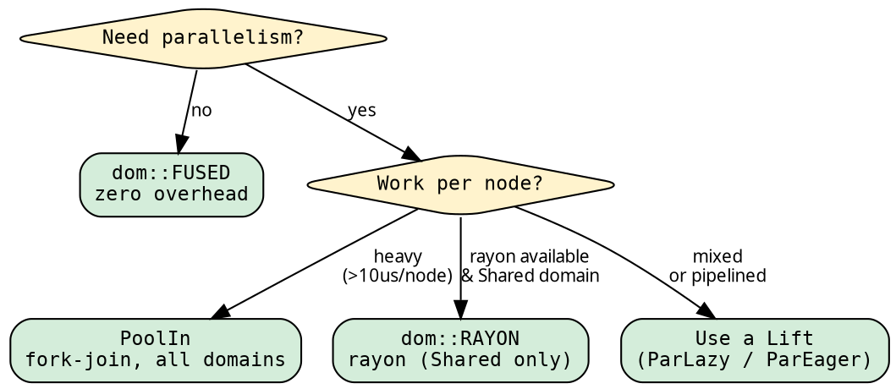

# Execution: choosing the strategy

The executor determines HOW the tree is traversed — sequential,
parallel, fused, unfused. Changing the executor changes the
performance characteristics without changing the fold or graph.

## One import, inherent methods

<!-- -->

```rust
use hylic::domain::shared as dom;
```

Every executor const has inherent `.run()` — no trait import:

```rust
{{#include ../../../src/docs_examples.rs:exec_usage}}
```

## When to use which executor

<!-- -->



| Executor | Domain | Best for | Overhead |
|----------|--------|----------|----------|
| `dom::FUSED` | all | Sequential, any workload | ~4us per 200 nodes |
| `dom::SEQUENTIAL` | all | Testing unfused path | Vec alloc per node |
| `dom::RAYON` | Shared | CPU-bound parallel work | rayon scheduling |
| `PoolIn<D>` | all | CPU-bound parallel, any domain | fork-join scheduling |
| Lifts | Shared | Mixed or pipelined workloads | Phase 1 + Phase 2 |

## The Pool executor

Our own parallel executor — no rayon dependency. Works with all
domains via SyncRef (scoped-thread safety wrapper):

```rust
use hylic::domain::shared as dom;
use hylic::cata::exec::{PoolIn, PoolSpec};
use hylic::prelude::{WorkPool, WorkPoolSpec};

WorkPool::with(WorkPoolSpec::threads(4), |pool| {
    let exec = PoolIn::<hylic::domain::Shared>::new(pool, PoolSpec::default_for(4));
    exec.run(&fold, &graph, &root);
});
```

Tree-aware fork-join: binary-split child processing with depth-based
sequential cutoff. Competitive with rayon, works with Local and
Owned domains too.

## Switching domains

Same closures, different constructor, different executor:

```rust
{{#include ../../../src/docs_examples.rs:domain_switching}}
```

The type system enforces compatibility — `dom::RAYON` only accepts
Shared-domain folds. The Pool executor accepts all domains.

See [Domain system](../design/domains.md) for details.

## Runtime dispatch

When the executor is chosen at runtime, use `DynExec`:

```rust
{{#include ../../../src/docs_examples.rs:runtime_dispatch}}
```

`DynExec` operates in the Shared domain. Its `.run()` is an inherent
method — no trait import needed.

## Lift integration

Every executor with inherent methods gets `.run_lifted()`:

```rust
{{#include ../../../src/docs_examples.rs:parlazy_usage}}
```

The Lift transforms fold + treeish, the executor runs the result.
See [Lifts](./lifts.md) for ParLazy, ParEager, and Explainer.

## Performance

See [Benchmarks](../cookbook/benchmarks.md) for the full comparison
across all execution modes, domains, and handrolled baselines.
