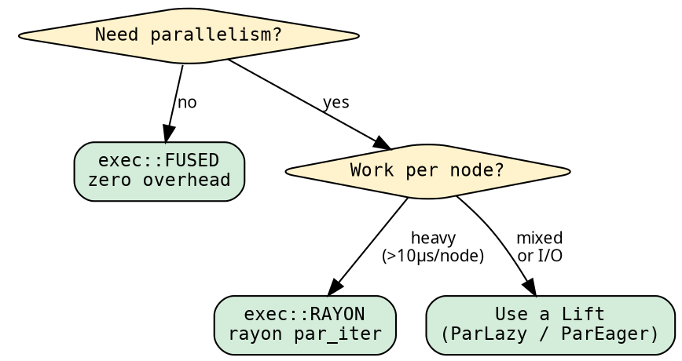

# Execution: choosing the strategy

The executor determines HOW the tree is traversed — sequential,
parallel, fused, unfused. Changing the executor changes the
performance characteristics without changing the fold or graph.

## The exec module

All executor concerns live in one namespace:

```rust
use hylic::cata::exec::{self, Executor};
```

`exec::FUSED`, `exec::RAYON`, etc. are zero-sized const values.
`Executor` is the trait — imported to call `.run()`.

## Switching executors

Same fold, same graph, one-token change:

```rust
{{#include ../../../src/docs_examples.rs:exec_usage}}
```

## When to use which executor



| Executor | Best for | Overhead |
|----------|----------|----------|
| `exec::FUSED` | Sequential, any workload | ~4µs per 200 nodes |
| `exec::SEQUENTIAL` | Testing unfused path | Vec alloc per node |
| `exec::RAYON` | CPU-bound parallel work | rayon scheduling |
| Lifts (ParLazy/ParEager) | Mixed or I/O workloads | Phase 1 + Phase 2 |

## Switching domains

The executor's type parameter determines the boxing domain.
Same closures, different constructor, different executor const:

```rust
{{#include ../../../src/docs_examples.rs:domain_switching}}
```

The type system enforces compatibility — `exec::RAYON` only accepts
Shared-domain folds. Passing an `owned::Fold` to `exec::RAYON` is a
compile error.

See [Domain system](../design/domains.md) for details.

## Runtime dispatch

When the executor is chosen at runtime, use the `Exec` enum:

```rust
{{#include ../../../src/docs_examples.rs:runtime_dispatch}}
```

`Exec` operates in the Shared domain. Its `.run()` is an inherent
method — no trait import needed (unlike the const values).

## Lift integration

Any Shared-domain executor gets `run_lifted` automatically:

```rust
use hylic::cata::exec::{self, Executor, ExecutorExt};
use hylic::prelude::{ParLazy, Explainer};

// Parallel evaluation:
let r = exec::FUSED.run_lifted(&ParLazy::lift(), &fold, &graph, &root);

// Computation tracing:
let (r, trace) = exec::FUSED.run_lifted_zipped(
    &Explainer::lift(), &fold, &graph, &root
);
```

`ExecutorExt` is a blanket trait — any `Executor<N, R, Shared>`
implements it automatically. Import it alongside `Executor` when
using Lifts.

## Performance

See [Benchmarks](../cookbook/benchmarks.md) for the full comparison
across all execution modes, domains, and handrolled baselines.
