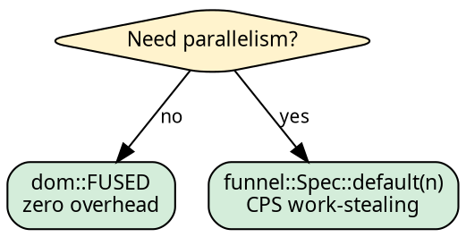

# Execution: choosing the strategy

The executor determines HOW the tree is traversed — sequential or
parallel. Changing the executor changes the performance without
changing the fold or graph. Every executor has the same interface:
`.run()`.

## One import, one method

```rust
use hylic::domain::shared as dom;

// Sequential:
dom::FUSED.run(&fold, &graph, &root);

// Parallel:
dom::exec(funnel::Spec::default(8)).run(&fold, &graph, &root);
```

No trait imports. The `.run()` method is **inherent** on `Exec<D, S>`.
`D` (domain) is fixed by the const or `exec()` call; `N`, `H`, `R`
are inferred from the arguments.

## Which executor



| Executor | Domain | Best for |
|----------|--------|----------|
| `dom::FUSED` | all | Sequential, any workload |
| Funnel | Shared | Parallel, any workload |

## The Funnel executor

hylic's built-in parallel executor. CPS work-stealing with
configurable queue, accumulation, and wake policies. See
[Funnel](../funnel/overview.md) for the full documentation.

**One-shot** — creates pool, runs, joins:

```rust
use hylic::cata::exec::funnel;
dom::exec(funnel::Spec::default(8)).run(&fold, &graph, &root);
```

**Session scope** — amortizes pool creation across folds:

```rust
dom::exec(funnel::Spec::default(8)).session(|s| {
    s.run(&fold, &graph, &root);
    s.run(&fold, &graph, &root);
});
```

**Explicit attach** — manual pool management:

```rust
funnel::Pool::with(8, |pool| {
    dom::exec(funnel::Spec::default(8)).attach(pool).run(&fold, &graph, &root);
});
```

See [Policies](../funnel/policies.md) for named presets and
workload-specific recommendations.

## Defining a project executor

For projects that use a specific funnel configuration throughout,
define the executor once and reference it everywhere:

```rust
use hylic::domain::shared as dom;
use hylic::cata::exec::funnel;

type MyPolicy = funnel::policy::Policy<
    funnel::queue::PerWorker,
    funnel::accumulate::OnArrival,
    funnel::wake::EveryK<4>,
>;

pub fn exec() -> hylic::cata::exec::Exec<hylic::domain::Shared, funnel::Spec<MyPolicy>> {
    let nw = std::thread::available_parallelism().map(|n| n.get()).unwrap_or(4);
    dom::exec(
        funnel::Spec::default(nw)
            .with_accumulate::<funnel::accumulate::OnArrival>(
                funnel::accumulate::on_arrival::OnArrivalSpec)
            .with_wake::<funnel::wake::EveryK<4>>(
                funnel::wake::every_k::EveryKSpec)
    )
}
```

A type alias names the policy axes. The function constructs the
spec from `default()` via axis transformations. Call sites use
`.run()` without knowing the policy details:

```rust
// Anywhere in the project:
crate::exec().run(&fold, &graph, &root);
```

The full policy type is inferred at every call site. Only the
definition site names it.

## Switching domains

Same closures, different constructor, different executor:

```rust
{{#include ../../../src/docs_examples.rs:domain_switching}}
```

The type system enforces compatibility. See
[Domain system](../design/domains.md) for details.

## Lift integration

Every executor gets `.run_lifted()`:

```rust
{{#include ../../../src/docs_examples.rs:explainer_usage}}
```

The Lift transforms fold + treeish, the executor runs the result.
See [Lifts](./lifts.md) for the Explainer.

## Under the hood

Every executor is a Spec — a `Copy` value that describes a
computation strategy. `.run()` on a Spec internally creates any
needed resources (thread pool for Funnel, nothing for Fused), runs
the fold, and cleans up. Sessions (`.session()`, `.attach()`)
let you hold the resource across multiple folds.

See [The Exec pattern](../executor-design/exec_pattern.md) for the
type-level design and [Policy traits](../executor-design/policy_traits.md)
for how Funnel's three axes compose.
