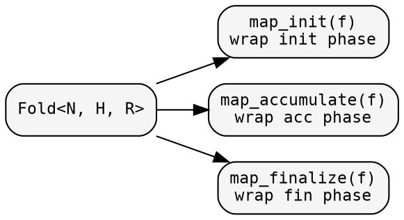
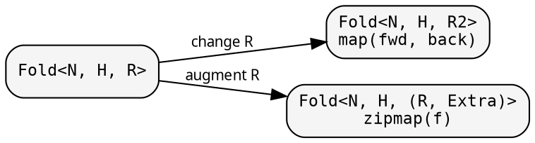

# Fold: shaping the computation

A `Fold<N, H, R>` defines three phases: init, accumulate, finalize.
Each phase is a closure behind Arc. Each can be transformed
independently — producing a new Fold without modifying the original.

## Named-closures-first pattern

Always extract closures before passing to the constructor:

```rust
{{#include ../../../src/docs_examples.rs:named_closures_pattern}}
```

This makes closures reusable across domains and readable without nesting.

## Phase transformations

Wrap individual phases without changing the fold's types:



### map_init — add side effects to initialization

```rust
{{#include ../../../src/docs_examples.rs:fold_map_init}}
```

The mapper receives the original init closure and returns a new one.
Useful for logging, instrumentation, or augmenting the initial heap.

## Result-type transformations

Change what the fold produces:



### zipmap — augment with extra data

```rust
{{#include ../../../src/docs_examples.rs:fold_zipmap}}
```

`zipmap` is the most common transformation — add extra computed data
without changing the fold's core logic.

## Node-type transformations

### contramap — change the input type

```rust
{{#include ../../../src/docs_examples.rs:fold_contramap}}
```

Only init sees the node. Contramap wraps init to transform the input.
Accumulate and finalize are unchanged.

## Composition

### product — two folds in one traversal

```rust
{{#include ../../../src/docs_examples.rs:fold_product}}
```

The categorical product: each fold maintains its own heap, sees its
own child results, produces its own output. One traversal, two results.
No double-visiting.

## Working example

```rust
{{#include ../../../src/cookbook/transformations.rs}}
```
