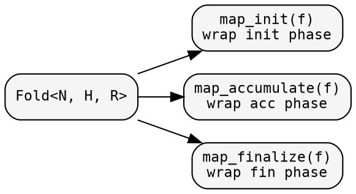
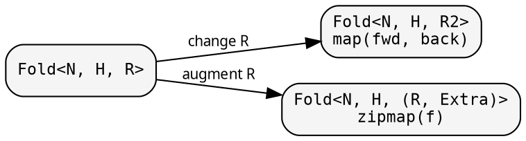

# Fold: shaping the computation

A `Fold<N, H, R>` defines three phases: init, accumulate, finalize.
Each phase is a closure behind Arc. Each can be transformed
independently — producing a new Fold without modifying the original.

## Named-closures-first pattern

Always extract closures before passing to the constructor:

```rust
let init = |n: &MyNode| n.value;
let acc  = |heap: &mut u64, child: &u64| *heap += child;
let fin  = |heap: &u64| *heap;
let fold = fold::fold(init, acc, fin);
```

This makes closures reusable across domains and readable without nesting.

## Phase transformations

Wrap individual phases without changing the fold's types:



### map_init — add side effects to initialization

```rust
let logged = fold.map_init(|orig_init| Box::new(move |n: &Node| {
    println!("visiting {}", n.name);
    orig_init(n)
}));
```

The mapper receives the original init closure and returns a new one.
Useful for logging, instrumentation, or augmenting the initial heap.

### map_accumulate — intercept child results

```rust
let counted = fold.map_accumulate(|orig_acc| Box::new(move |h, r| {
    println!("  child result: {:?}", r);
    orig_acc(h, r);
}));
```

### map_finalize — post-process the result

```rust
let clamped = fold.map_finalize(|orig_fin| Box::new(move |h| {
    let r = orig_fin(h);
    r.min(1000)  // clamp result
}));
```

## Result-type transformations

Change what the fold produces:



### map — transform the result type

```rust
// Convert u64 result to String
let string_fold = fold.map(
    |r: &u64| format!("total: {}", r),   // forward: R → R2
    |s: &String| s.parse().unwrap(),       // backward: R2 → R (for accumulate)
);
```

The backward function is needed because `accumulate` receives child
results — they must be in the original type for the original accumulate
to process them.

### zipmap — augment with extra data

```rust
let with_count = fold.zipmap(|r: &u64| if *r > 100 { "large" } else { "small" });
// Result: (u64, &str) — original result + classification
let (total, category) = exec::FUSED.run(&with_count, &graph, &root);
```

`zipmap` is the most common transformation — add extra computed data
without changing the fold's core logic.

## Node-type transformations

### contramap — change the input type

```rust
// Fold<Module, H, R> → Fold<String, H, R>
let by_name = fold.contramap(|name: &String| lookup_module(name));
```

Only init sees the node. Contramap wraps init to transform the input.
Accumulate and finalize are unchanged.

## Composition

### product — two folds in one traversal

```rust
let both = size_fold.product(&depth_fold());
let (total_size, max_depth) = exec::FUSED.run(&both, &graph, &root);
```

The categorical product: each fold maintains its own heap, sees its
own child results, produces its own output. One traversal, two results.
No double-visiting.

## Working example

```rust
{{#include ../../../src/cookbook/transformations.rs}}
```
