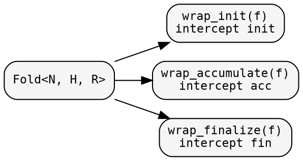
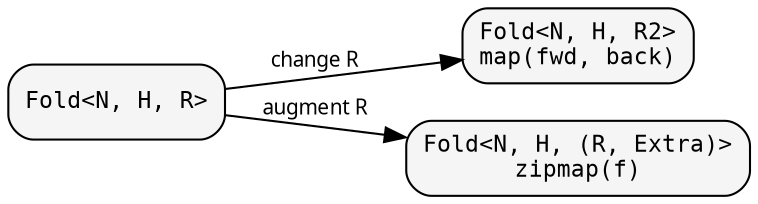

# Fold: shaping the computation

A `Fold<N, H, R>` is defined by three phases: `init`,
`accumulate`, and `finalize`. Each phase is a closure stored in
the boxing strategy of the [domain](../concepts/domains.md) in
use — `Arc` for Shared, `Rc` for Local, `Box` for Owned. Each
phase may be transformed independently.

## Named-closures-first pattern

Closures should be extracted and named before being passed to the
constructor:

```rust
{{#include ../../../src/docs_examples.rs:named_closures_pattern}}
```

This form allows closures to be reused across domains and read
without nesting.

## Phase transformations

Wrap individual phases without changing the fold's types:



### wrap_init — adding side effects at initialisation

<!-- -->

```rust
{{#include ../../../src/docs_examples.rs:fold_wrap_init}}
```

The wrapper receives the node and the original `init` as a
callable reference. The closure may invoke it, modify its result,
add side effects, or bypass it entirely. The mechanism is
available in all three domains.

## Result-type transformations

Change what the fold produces:



### zipmap — augmenting the result

<!-- -->

```rust
{{#include ../../../src/docs_examples.rs:fold_zipmap}}
```

`zipmap` is the most common transformation: additional computed
data is attached to the result without altering the fold's core
logic.

## Node-type transformations

### contramap — changing the input type

<!-- -->

```rust
{{#include ../../../src/docs_examples.rs:fold_contramap}}
```

Only `init` consumes the node directly. `contramap` wraps `init`
to transform the input; `accumulate` and `finalize` are left
unchanged. See also
[Transforms and variance](../concepts/transforms.md#three-transforms-three-shapes)
for the variance story that dictates the argument shape.

## Composition

### product — two folds, one traversal

<!-- -->

```rust
{{#include ../../../src/docs_examples.rs:fold_product}}
```

The categorical product: each fold maintains its own heap,
observes its own child results, and produces its own output. One
traversal yields two results; no node is visited twice.

## Domain parity

All three domains support the same transformation surface:

| Method | Shared | Local | Owned | Effect |
|--------|--------|-------|-------|--------|
| `wrap_init` | `&self` | `&self` | `self` | intercept init phase |
| `wrap_accumulate` | `&self` | `&self` | `self` | intercept accumulate phase |
| `wrap_finalize` | `&self` | `&self` | `self` | intercept finalize phase |
| `map` | `&self` | `&self` | `self` | change result type R → R2 |
| `zipmap` | `&self` | `&self` | `self` | augment result (R, Extra) |
| `contramap` | `&self` | `&self` | `self` | change node type N → N2 |
| `product` | `&self` | `&self` | `self` | two folds, one traversal |

`Shared` and `Local` borrow `&self`, so the original fold is
preserved; `Owned` consumes `self`, moving the original into the
result. All three delegate to the same domain-independent
combinator functions in `fold/combinators.rs`; auto-trait
propagation ensures that `Send + Sync` flows correctly for
`Shared`.

All domains also expose `.init()`, `.accumulate()`, and
`.finalize()` as direct methods, in addition to the `FoldOps`
trait implementation.

See [The three domains](../concepts/domains.md) for guidance on
when to select which domain.

## Working example

<!-- -->

```rust
{{#include ../../../src/cookbook/transformations.rs}}
```
