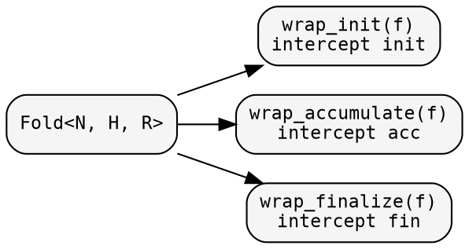
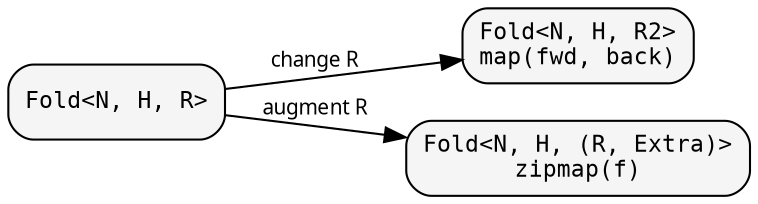

# Fold: shaping the computation

A `Fold<N, H, R>` defines three phases: init, accumulate, finalize.
Each phase is a closure stored in the domain's boxing strategy (Arc
for Shared, Rc for Local, Box for Owned). Each can be transformed
independently.

## Named-closures-first pattern

Always extract closures before passing to the constructor:

```rust
{{#include ../../../src/docs_examples.rs:named_closures_pattern}}
```

This makes closures reusable across domains and readable without nesting.

## Phase transformations

Wrap individual phases without changing the fold's types:



### wrap_init — add side effects to initialization

<!-- -->

```rust
{{#include ../../../src/docs_examples.rs:fold_wrap_init}}
```

The wrapper receives the node and the original init as a callable
reference. Call it, modify the result, add side effects — or skip
it entirely. Works across all three domains.

## Result-type transformations

Change what the fold produces:



### zipmap — augment with extra data

<!-- -->

```rust
{{#include ../../../src/docs_examples.rs:fold_zipmap}}
```

`zipmap` is the most common transformation — add extra computed data
without changing the fold's core logic.

## Node-type transformations

### contramap — change the input type

<!-- -->

```rust
{{#include ../../../src/docs_examples.rs:fold_contramap}}
```

Only init sees the node. Contramap wraps init to transform the input.
Accumulate and finalize are unchanged.

## Composition

### product — two folds in one traversal

<!-- -->

```rust
{{#include ../../../src/docs_examples.rs:fold_product}}
```

The categorical product: each fold maintains its own heap, sees its
own child results, produces its own output. One traversal, two results.
No double-visiting.

## Domain parity

All three domains support the same transformation surface:

| Method | Shared | Local | Owned | Effect |
|--------|--------|-------|-------|--------|
| `wrap_init` | `&self` | `&self` | `self` | intercept init phase |
| `wrap_accumulate` | `&self` | `&self` | `self` | intercept accumulate phase |
| `wrap_finalize` | `&self` | `&self` | `self` | intercept finalize phase |
| `map` | `&self` | `&self` | `self` | change result type R → R2 |
| `zipmap` | `&self` | `&self` | `self` | augment result (R, Extra) |
| `contramap` | `&self` | `&self` | `self` | change node type N → N2 |
| `product` | `&self` | `&self` | `self` | two folds, one traversal |

Shared and Local borrow `&self` — the original fold is preserved.
Owned consumes `self` — the original is moved into the result. All
three call the same domain-independent combinator functions
(`fold/combinators.rs`); auto-trait propagation ensures Send+Sync
flows correctly for Shared.

All domains also expose `.init()`, `.accumulate()`, `.finalize()` as
direct methods, in addition to the `FoldOps` trait implementation.

See [Domain system](../design/domains.md) for when to use which domain.

## Working example

<!-- -->

```rust
{{#include ../../../src/cookbook/transformations.rs}}
```
