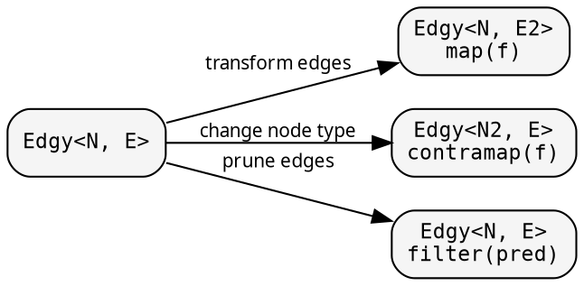

# Graph: controlling traversal

The graph — `Treeish<N>` or `Edgy<N, E>` — is a function from a node
to its children. It determines what gets visited during the fold.
The node type N can be any type: a struct, an integer index, a
string key, a database identifier. The tree structure lives in the
function, not in the data.

## Constructors

Three ways to create a `Treeish<N>`:

```rust
{{#include ../../../src/docs_examples.rs:treeish_constructors}}
```

`treeish_visit` is the most general form — the callback receives
each child without allocating a Vec. `treeish` wraps a Vec-returning
function for convenience. `treeish_from` extracts a slice reference
from a field.

For non-nested data (adjacency lists, maps, external lookups), use
`treeish_visit` directly:

```rust
// Adjacency list: nodes are indices
let adj: Vec<Vec<usize>> = vec![vec![1, 2], vec![3], vec![], vec![]];
let graph = graph::treeish_visit(move |n: &usize, cb: &mut dyn FnMut(&usize)| {
    for &c in &adj[*n] { cb(&c); }
});

// HashMap-backed graph: nodes are string keys
let edges: HashMap<String, Vec<String>> = /* ... */;
let graph = graph::treeish_visit(move |n: &String, cb: &mut dyn FnMut(&String)| {
    if let Some(children) = edges.get(n) {
        for c in children { cb(c); }
    }
});
```

## Edge transformations

The `Edgy<N, E>` type generalizes `Treeish<N>` — edges and nodes
can be different types. Combinators transform the edge or node type:



### filter — prune children

<!-- -->

```rust
{{#include ../../../src/docs_examples.rs:graph_filter}}
```

The fold receives fewer children without knowing about the pruning.

## Caching: memoize_treeish

For DAGs where the same node is reachable from multiple parents,
`memoize_treeish` caches the children computation:

```rust
{{#include ../../../src/docs_examples.rs:memoize_example}}
```

The first visit to a key computes and caches its children.
Subsequent visits return the cached result.

## Visit combinator

`Edgy::at(node)` returns a `Visit<T, F>` — a push-based iterator
with `map`, `filter`, `fold`, `count`, `collect_vec`. All
callback-based internally.
