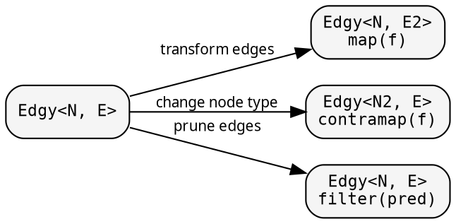

# Graph: controlling traversal

The graph — `Treeish<N>` or `Edgy<N, E>` — determines which children
each node has. Transform the graph to change what gets visited,
without touching the fold.

## Constructors

Three ways to create a `Treeish<N>`:

```rust
// Callback-based (zero allocation per visit):
let graph = treeish_visit(|n: &Node, cb: &mut dyn FnMut(&Node)| {
    for child in &n.children { cb(child); }
});

// Vec-returning (allocates per visit):
let graph = treeish(|n: &Node| n.children.clone());

// Slice accessor (borrows, zero allocation):
let graph = treeish_from(|n: &Node| n.children.as_slice());
```

Prefer `treeish_visit` for performance — no Vec allocation per node.

## Edge transformations



### filter — prune children

```rust
// Only visit children with value > threshold
let pruned = graph.filter(|child: &Node| child.value > threshold);
exec::FUSED.run(&fold, &pruned, &root);
```

Same fold, fewer children. The fold doesn't know about the pruning.

### map — transform edge values

```rust
let mapped = edgy.map(|edge: &RawEdge| Edge::parse(edge));
```

For `Treeish<N>` (where edges = nodes), `map` changes the child type.

### contramap — change the node type

```rust
let adapted = graph.contramap(|id: &NodeId| lookup_node(*id));
```

Wraps the visit function to transform the input node before visiting.

## Caching: memoize_treeish

For DAGs (directed acyclic graphs) where the same node appears
multiple times, `memoize_treeish` caches the children computation:

```rust
use hylic::prelude::memoize_treeish;

let cached = memoize_treeish(&graph);
exec::FUSED.run(&fold, &cached, &root);
```

The first visit to a node computes and caches its children. Subsequent
visits return the cached result. This turns a DAG traversal into an
efficient graph traversal without revisiting.

For custom keys (when `N` doesn't implement `Hash + Eq`):

```rust
let cached = memoize_treeish_by(&graph, |n: &Node| n.id.clone());
```

## Visit combinator

`Edgy::at(node)` returns a `Visit` — a zero-allocation push-based
iterator:

```rust
let children: Vec<Node> = graph.at(&root).collect_vec();
let count = graph.at(&root).count();
let mapped: Vec<String> = graph.at(&root).map(|n| n.name.clone()).collect_vec();
let filtered: Vec<Node> = graph.at(&root).filter(|n| n.active).collect_vec();
```

`Visit` supports `map`, `filter`, `fold`, `count`, `collect_vec` —
all zero-allocation (callback-based internally).
