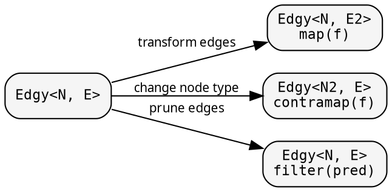

# Graph: controlling traversal

The graph — `Treeish<N>` or `Edgy<N, E>` — determines which children
each node has. Transform the graph to change what gets visited,
without touching the fold.

## Constructors

Three ways to create a `Treeish<N>`:

```rust
{{#include ../../../src/docs_examples.rs:treeish_constructors}}
```

Prefer `treeish_visit` for performance — no Vec allocation per node.

## Edge transformations

<!-- -->



### filter — prune children

<!-- -->

```rust
{{#include ../../../src/docs_examples.rs:graph_filter}}
```

Same fold, fewer children. The fold doesn't know about the pruning.

## Caching: memoize_treeish

For DAGs (directed acyclic graphs) where the same node appears
multiple times, `memoize_treeish` caches the children computation:

```rust
{{#include ../../../src/docs_examples.rs:memoize_example}}
```

The first visit to a node computes and caches its children. Subsequent
visits return the cached result.

## Visit combinator

`Edgy::at(node)` returns a `Visit<T, F>` — a zero-allocation
push-based iterator. Supports `map`, `filter`, `fold`, `count`,
`collect_vec`. All callback-based internally — no intermediate
allocations.
