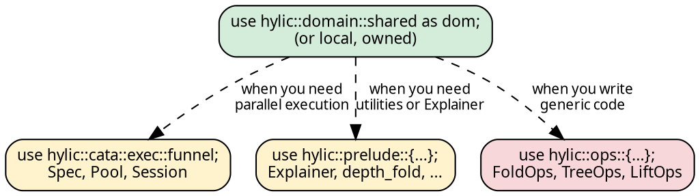

# Import patterns

One import. Everything works.

## The single-import pattern

<!-- -->

```rust
use hylic::domain::shared as dom;
```

This gives you fold constructors, treeish constructors, the Fused
executor, and all the types you need:

```rust
use hylic::domain::shared as dom;

let fold  = dom::simple_fold(|n: &i32| *n as u64, |h: &mut u64, c: &u64| *h += c);
let graph = dom::treeish(|n: &i32| if *n > 1 { vec![n - 1, n - 2] } else { vec![] });
let result = dom::FUSED.run(&fold, &graph, &5);
```

No trait imports. No `use Executor`. The `.run()` and `.run_lifted()`
methods are **inherent** on each executor — they exist on the type
itself, not via a trait.

## What the domain module provides

Each domain module (`shared`, `local`, `owned`) exports:

| Category | Examples |
|----------|----------|
| **Executor consts** | `FUSED` |
| **Executor factory** | `exec(spec)` — bind any Spec to the domain |
| **Fold constructors** | `fold()`, `simple_fold()` |
| **Fold types** | `Fold` |
| **Graph constructors** | `treeish()`, `treeish_visit()`, `treeish_from()`, `edgy()` |
| **Graph types** | `Treeish`, `Edgy`, `Graph`, `SeedGraph` |
| **Pipeline** | `GraphWithFold` (Shared only) |

## Switching domains

Change the import, same code:

```rust
{{#include ../../../src/docs_examples.rs:domain_switching}}
```

The closures (`init`, `acc`, `fin`, `children`) are domain-independent.
Only the constructor and executor const change.

## When you need more

**Parallel execution** — the Funnel executor:

```rust
use hylic::domain::shared as dom;
use hylic::cata::exec::funnel;

// One-shot:
dom::exec(funnel::Spec::default(8)).run(&fold, &graph, &root);

// Session scope (amortized pool reuse):
dom::exec(funnel::Spec::default(8)).session(|s| {
    s.run(&fold, &graph, &root);
});
```

**Prelude utilities** — Explainer (trace), formatting, common folds:

```rust
use hylic::prelude::{Explainer, depth_fold, TreeFormatCfg};
```

**Operations traits** — needed only for generic or zero-boxing code:

```rust
use hylic::ops::{FoldOps, TreeOps};
```

**The `Executor` trait** — needed only for trait-generic code
(accepting any executor as a parameter):

```rust
use hylic::cata::exec::Executor;
```

Most code never needs these — the inherent methods handle everything.

## The hierarchy

<!-- -->



Most users only need the green box. The yellow boxes are for parallel
execution and utilities. The red box is for advanced generic
programming.
