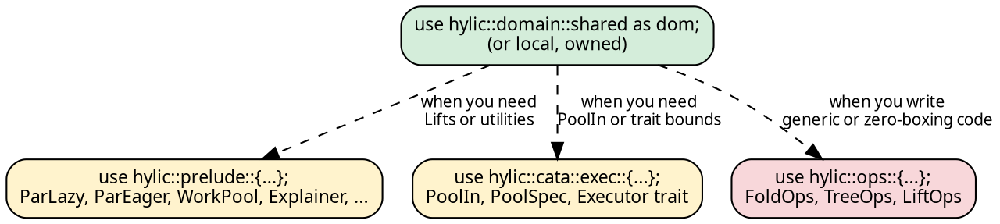

# Import patterns

One import. Everything works.

## The single-import pattern

<!-- -->

```rust
use hylic::domain::shared as dom;
```

This gives you fold constructors, treeish constructors, executor
consts, and all the types you need:

```rust
use hylic::domain::shared as dom;

let fold  = dom::simple_fold(|n: &i32| *n as u64, |h: &mut u64, c: &u64| *h += c);
let graph = dom::treeish(|n: &i32| if *n > 1 { vec![n - 1, n - 2] } else { vec![] });
let result = dom::FUSED.run(&fold, &graph, &5);
```

No trait imports. No `use Executor`. The `.run()`, `.run_lifted()`,
and `.run_lifted_zipped()` methods are **inherent** on each executor
const — they exist on the type itself, not via a trait.

## What the domain module provides

Each domain module (`shared`, `local`, `owned`) exports everything
needed to work in that domain:

| Category | Examples |
|----------|----------|
| **Executor consts** | `FUSED`, `SEQUENTIAL`, `RAYON` (Shared only) |
| **Fold constructors** | `fold()`, `simple_fold()` |
| **Fold types** | `Fold`, `InitFn`, `AccumulateFn`, `FinalizeFn` |
| **Graph constructors** | `treeish()`, `treeish_visit()`, `treeish_from()`, `edgy()` |
| **Graph types** | `Treeish`, `Edgy`, `Graph`, `SeedGraph` |
| **Runtime dispatch** | `DynExec` |
| **Pipeline** | `GraphWithFold` (Shared only) |

## Switching domains

Change the import, same code:

```rust
{{#include ../../../src/docs_examples.rs:domain_switching}}
```

The closures (`init`, `acc`, `fin`, `children`) are domain-independent.
Only the constructor and executor const change.

## When you need more

**Parallel strategies** come from `prelude`:

```rust
use hylic::domain::shared as dom;
use hylic::prelude::{ParLazy, ParEager, WorkPool, WorkPoolSpec};

WorkPool::with(WorkPoolSpec::threads(4), |pool| {
    dom::FUSED.run_lifted(&ParLazy::lift(pool), &fold, &graph, &root);
});
```

**Pool executor** comes from `cata::exec`:

```rust
use hylic::cata::exec::{PoolIn, PoolSpec};

WorkPool::with(WorkPoolSpec::threads(4), |pool| {
    let exec = PoolIn::<hylic::domain::Shared>::new(pool, PoolSpec::default_for(4));
    exec.run(&fold, &graph, &root);
});
```

**Operations traits** (`FoldOps`, `TreeOps`) are needed only when
writing generic code or custom zero-boxing types:

```rust
use hylic::ops::{FoldOps, TreeOps};
```

**The `Executor` trait** is needed only for trait-generic code
(e.g., accepting any executor as a parameter):

```rust
use hylic::cata::exec::Executor;
fn run_with<E: Executor<N, R, D>>(...) { ... }
```

Most code never needs these — the inherent methods on executor consts
handle everything.

## The hierarchy

<!-- -->



Most users only need the green box. The yellow boxes are for parallel
strategies and the pool executor. The red box is for advanced generic
programming.
