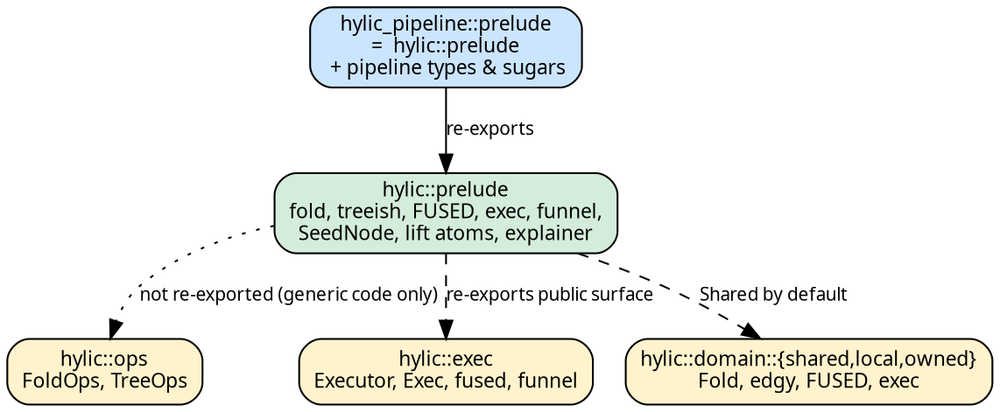

# Import patterns

Two preludes cover everything most users need:

- `hylic::prelude::*` — core: domain markers (`Shared` / `Local` /
  `Owned`), Shared-default `Fold` and `Treeish` constructors,
  executor helpers (`FUSED`, `exec`), every lift atom (`Lift`,
  `IdentityLift`, `ComposedLift`, `ShapeLift`, `SeedLift`,
  `LiftBare`, `SeedNode`), and explainer/format helpers.
- `hylic_pipeline::prelude::*` — re-exports the core prelude **plus**
  pipeline typestates (`SeedPipeline`, `TreeishPipeline`,
  `Stage2Pipeline`, `OwnedPipeline`), source traits
  (`TreeishSource`, `PipelineExec`, `PipelineExecOnce`,
  `PipelineSourceOnce`), and the sugar trait families
  (`SeedSugars*`, `TreeishSugars*`, `Stage2Sugars*`).

A complete program — fold + graph + executor — needs exactly one
prelude line:

```rust,no_run
use hylic::prelude::*;

let fold  = fold(|n: &i32| *n as u64,
                 |h: &mut u64, c: &u64| *h += c,
                 |h: &u64| *h);
let graph = treeish(|n: &i32| if *n > 1 { vec![n - 1, n - 2] } else { vec![] });
let total = FUSED.run(&fold, &graph, &5);
```

`FUSED` is the sequential executor, available as a const on the
Shared domain. `fold` and `treeish` are the Shared-default
constructors — for Local or Owned, take the per-domain path
(below).

## Switching domains

For `Local` or `Owned` construction, address the domain module
directly. The closures don't change; only the constructor and the
executor binding do:

```rust
{{#include ../../../src/docs_examples.rs:domain_switching}}
```

## Parallel execution

Funnel comes in through the prelude as the `funnel` module:

```rust,no_run
use hylic::prelude::*;
let total = exec(funnel::Spec::default(8)).run(&fold, &graph, &root);
```

Spec presets (`default`, `for_wide_light`, `for_deep_narrow`, …)
are documented in [Funnel policies](../funnel/policies.md). For
amortised pool reuse across many folds, use
`.session(|s| s.run(...))`.

## Pipeline programs

Pipelines layer on the same imports — switch to the pipeline
prelude:

```rust,no_run
use hylic_pipeline::prelude::*;
```

That single line brings the core prelude with it; users do not
import `hylic::prelude` separately. From there, every Stage-1
constructor (`SeedPipeline::new`, `TreeishPipeline::new`,
`OwnedPipeline::new`) and every sugar (`.lift()`, `.then_lift(…)`,
`.zipmap(…)`, `.wrap_init(…)`, `.explain()`, `.run(…)`) is in
scope.

A full pipeline example is at the end of
[Pipelines — overview](../pipeline/overview.md).

## When you need bare module paths

The preludes cover normal usage. The bare module paths are useful
for

- **Generic code over executors or operations**

  ```rust,no_run
  use hylic::ops::{FoldOps, TreeOps};
  use hylic::exec::Executor;
  ```

- **Per-domain primitives** (e.g. when you keep
  `hylic::prelude` *and* want `Local` constructors visible at the
  same names): import the domain module under an alias —

  ```rust,no_run
  use hylic::domain::local as ldom;
  let lf = ldom::fold(|n: &i32| *n as u64,
                      |h: &mut u64, c: &u64| *h += c,
                      |h: &u64| *h);
  ldom::FUSED.run(&lf, &graph, &root);
  ```

- **Crate-internal lift atoms not in the prelude**: `Traced`,
  `memoize_treeish`, `VecFold`, etc. live one level under
  `hylic::prelude::*` (they are public modules but excluded from
  the wildcard re-export). Import explicitly.

## Module map


