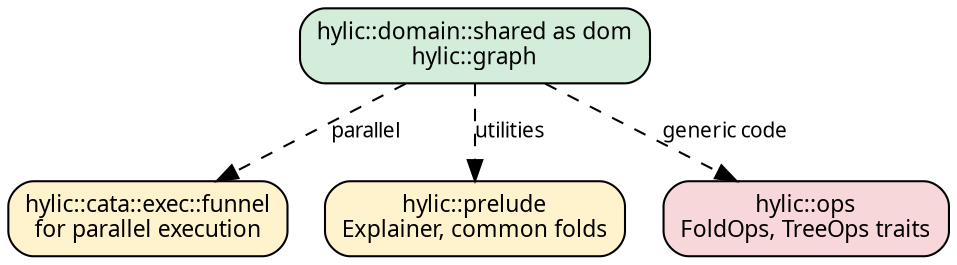

# Import patterns

hylic organizes its public surface into a small number of modules.
A typical program requires two imports: a domain module for fold
construction, and the graph module for tree structure.

## The standard imports

```rust
use hylic::domain::shared as dom;   // fold constructors, exec(), FUSED
use hylic::graph;                    // graph constructors, composition types
```

A complete example using both:

```rust
use hylic::domain::shared as dom;
use hylic::graph;

let fold  = dom::simple_fold(|n: &i32| *n as u64, |h: &mut u64, c: &u64| *h += c);
let graph = graph::treeish(|n: &i32| if *n > 1 { vec![n - 1, n - 2] } else { vec![] });
let result = dom::FUSED.run(&fold, &graph, &5);
```

The `.run()` method is inherent on `Exec<D, S>`, so no trait import
is needed for basic usage.

## What each module provides

**Domain modules** (`domain::shared`, `domain::local`, `domain::owned`)
export the fold type and its constructors, plus executor binding:

| Export | Purpose |
|--------|---------|
| `Fold`, `fold()`, `simple_fold()` | Fold type and constructors |
| `FUSED` | Sequential executor (all domains) |
| `exec(spec)` | Bind a parallel executor to this domain |

**The graph module** (`hylic::graph`) exports graph types and
constructors. These are domain-independent — the same `Treeish` works
with any domain's executor:

| Export | Purpose |
|--------|---------|
| `Treeish`, `Edgy` | Arc-based graph types with combinators |
| `treeish()`, `treeish_visit()`, `treeish_from()` | Treeish constructors |
| `edgy()`, `edgy_visit()` | General edge function constructors |
| `Graph`, `Edgy` combinators | Graph composition |

## Switching domains

To switch the fold domain, change the domain import. The graph import
and the closure definitions remain the same:

```rust
{{#include ../../../src/docs_examples.rs:domain_switching}}
```

The closures are domain-independent — only the fold constructor and
the executor constant change.

## Additional imports

For parallel execution, import the Funnel executor:

```rust
use hylic::cata::exec::funnel;

dom::exec(funnel::Spec::default(8)).run(&fold, &graph, &root);

// Or with a session scope for amortized pool reuse:
dom::exec(funnel::Spec::default(8)).session(|s| {
    s.run(&fold, &graph, &root);
});
```

For prelude utilities (Explainer, common folds, formatting):

```rust
use hylic::prelude::{Explainer, depth_fold, TreeFormatCfg};
```

For the operations traits (needed in generic code that accepts
arbitrary folds or graphs as parameters):

```rust
use hylic::ops::{FoldOps, TreeOps};
```

For the Executor trait (needed when writing functions that accept
any executor):

```rust
use hylic::cata::exec::Executor;
```

## Import hierarchy

The typical progression from simple to advanced usage:


