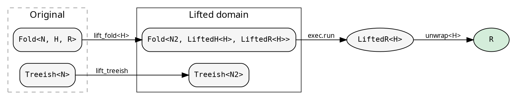

# Lifts: cross-cutting concerns

A lift transforms both the fold and the treeish into a different type
domain, runs the computation there, and maps the result back. The
caller receives the same `R` — the lift is transparent.

The `LiftOps` trait defines the four operations. The lifted heap and
result types are GATs (`LiftedH<H>`, `LiftedR<H>`), so each lift
determines how H maps to its lifted counterpart without requiring H
as a trait-level parameter:



## Explainer — computation tracing

The `Explainer` is a unit struct implementing `LiftOps<N, R, N>` for
all Clone types. It records every step of the fold at every node:
the initial heap, each child result accumulated, and the final result.
This is a histomorphism — each node sees its subtree's full
computation history.

```rust
{{#include ../../../src/docs_examples.rs:explainer_usage}}
```

The `ExplainerResult` contains the original result plus the full
`ExplainerHeap` — initial state, node, transitions, and working heap.

## The LiftOps trait

A lift provides four operations:

- **lift_treeish**: transform `Treeish<N>` → `Treeish<N2>`
- **lift_fold\<H\>**: transform `Fold<N, H, R>` → `Fold<N2, LiftedH<H>, LiftedR<H>>`
- **lift_root**: transform `&N` → `N2`
- **unwrap\<H\>**: extract `R` from `LiftedR<H>`

`lift_fold` and `unwrap` are generic over H (the original fold's heap
type). The trait's GATs `LiftedH<H>` and `LiftedR<H>` determine the
lifted types per lift implementation. H is bounded by `Clone + 'static`
— lifts inherently copy heap state between phases.

Concrete lifts implement `LiftOps` directly as structs. The Explainer
is a unit struct (no state). The `SeedLift` carries a grow function.
Parallel lifts in the `hylic-parallel-lifts` crate carry pool references.

## Execution

`cata::lift::run_lifted` applies the four operations and runs the
result through any Shared-domain executor:

```rust
use hylic::cata::lift;

let result = lift::run_lifted(&exec, &Explainer, &fold, &graph, &root);
let (result, trace) = lift::run_lifted_zipped(&exec, &Explainer, &fold, &graph, &root);
```

H is inferred from the fold. The executor runs the lifted fold on the
lifted treeish. `unwrap` extracts R from the lifted result.

## The mathematical picture

A fold is an F-algebra: a function `F<R> → R` that collapses one
layer of structure. hylic decomposes it into three phases
(init/accumulate/finalize) through the intermediate heap type H.

A lift is a natural transformation between two F-algebras. It maps
the carrier types through the `LiftedH` and `LiftedR` GATs while
preserving the fold structure. The `unwrap` function projects back
to R. The computation produces the same result regardless of which
algebra it runs in.
