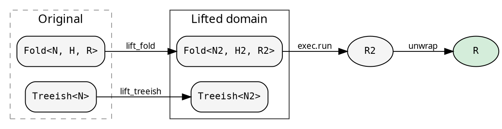
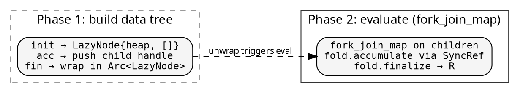
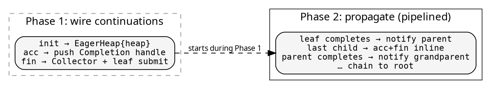

# Lifts: cross-cutting concerns

A Lift transforms both the Fold and Treeish into a different type
domain, runs the computation there, and maps the result back. The
caller gets the same `R` — the Lift is transparent.

<!-- -->



Lifts are domain-generic — they work with Shared and Local domains
via `ConstructFold`. The domain parameter `D` flows through:
`ParLazy::lift::<D, N, H, R>(pool)` where D is inferred from the
executor.

## The data tree insight

The parallel lifts (ParLazy, ParEager) decouple **data** from
**operations**. Phase 1 builds a tree of pure data nodes — heap
values and child handles, no fold closures captured. Phase 2 applies
the fold's accumulate and finalize through an external reference.

This decoupling is what makes domain-generic parallelism possible.
Without it, each node would capture domain-specific closures (Arc
for Shared, Rc for Local), and Rc closures can't cross thread
boundaries. By keeping fold operations external, the data nodes are
domain-agnostic.

## Explainer — computation tracing

Records every step of the fold at every node: the initial heap,
each child result accumulated, and the final result. A histomorphism
— each node sees its subtree's full computation history.

```rust
{{#include ../../../src/docs_examples.rs:explainer_usage}}
```

The `ExplainerResult` contains the original result plus the full
`ExplainerHeap` — initial state, node, transitions (each with the
incoming child result and resulting heap state), and working heap.

Use the Explainer for debugging, visualization, or understanding
how a fold processes a specific tree.

## ParLazy — two-pass parallel evaluation

Phase 1 builds a tree of `LazyNode` values — each storing its heap
and child handles. Phase 2 evaluates bottom-up via `fork_join_map`
on a `WorkPool`, borrowing the fold through `SyncRef`.

```rust
{{#include ../../../src/docs_examples.rs:parlazy_usage}}
```

<!-- -->



**Two-pass**: Phase 1 completes entirely before Phase 2 starts.
The fold is borrowed at evaluation time via `SyncRef` — no fold
closures are captured in the tree nodes.

**Bounds**: `H: Clone, R: Clone + Send`. No `H: Send` needed —
heaps stay in the data tree, accessed through SyncRef.

**Best when**: init is expensive relative to acc+fin. Phase 1 does
the heavy work (fold.init per node), Phase 2 does the lightweight
accumulation in parallel.

## ParEager — pipelined continuation-passing

Phase 1 wires a continuation chain during the fused traversal.
Leaf nodes submit work to the pool immediately — Phase 2 starts
**during** Phase 1. When a child completes, it notifies the parent
`Collector`. The last child to arrive runs the parent's acc+fin
**inline on its own thread** — no new task, no blocking.

```rust
{{#include ../../../src/docs_examples.rs:pareager_usage}}
```

<!-- -->



**Pipelined**: Phase 2 starts as soon as the first leaf is visited.
The fold is accessed through `FoldPtr` — a lifetime-erased raw
pointer to the fold's operations (domain-generic, no Arc cloning).

**Bounds**: `H: Clone + Send, R: Clone + Send`. `H: Send` is
needed because heaps cross thread boundaries into the Collector's
`Mutex<H>`.

**Best when**: acc+fin are expensive (they run in parallel via
continuation-passing). The pipelining benefit grows when both
phases have significant work.

### EagerSpec — controlling parallelism granularity

`ParEager::lift(pool, spec)` takes an `EagerSpec` with two knobs:

- **`min_children_to_fork`** (default 2): minimum children to create
  a Collector. Below this, accumulate inline (wait + help the pool).
- **`min_height_to_fork`** (default 2): minimum subtree height to
  fork. Nodes near the leaves (small subtrees) go sequential — the
  Collector + Completion overhead isn't worth it for tiny trees.

Height is computed naturally in the catamorphism (children finalize
before parent → parent knows `max(child_heights) + 1`). It adapts
to local subtree shape without needing global tree knowledge.

```rust
use hylic::prelude::EagerSpec;

// Default: min_children=2, min_height=2
let spec = EagerSpec::default_for(num_workers);

// Aggressive parallelism (even small subtrees)
let spec = EagerSpec { min_children_to_fork: 2, min_height_to_fork: 1 };

// Conservative (only large subtrees)
let spec = EagerSpec { min_children_to_fork: 4, min_height_to_fork: 3 };
```

## Combining executors with Lifts

The executor controls Phase 1 traversal. The Lift controls Phase 2.
Any valid executor × lift × domain combination works:

| Phase 1 executor | ParLazy | ParEager |
|---|---|---|
| `dom::FUSED` | Sequential build → parallel eval | Sequential build → pipelined continuations |
| `dom::SEQUENTIAL` | Vec-based build → parallel eval | Vec-based build → pipelined continuations |
| `dom::RAYON` | Parallel build → parallel eval | Parallel build → pipelined continuations |
| `PoolIn<D>` | Parallel build → parallel eval | Parallel build → pipelined continuations |

Domain support:

| | Shared | Local | Owned |
|---|:---:|:---:|:---:|
| ParLazy | yes | yes | — |
| ParEager | yes | yes | — |
| Explainer | yes | — | — |

Owned domain folds are not Clone (Box storage), and `run_lifted`
requires Clone. Local works because Rc-based folds are Clone.

The **eager+pool** combination is the recommended all-rounder:
Pool parallelizes Phase 1, and ParEager's continuations parallelize
Phase 2. Together, both phases get concurrent execution.

## Writing your own Lift

A Lift is four functions:
`Lift::new(lift_treeish, lift_fold, lift_root, unwrap)`.

Common patterns:
- **Identity treeish**: `|t| t` — don't change the tree, only the fold
- **Wrapping heap**: H2 contains the original H plus extra state
- **Deferred result**: R2 is a handle that produces R on unwrap
- **Fold stash**: `Rc<RefCell<Option<fold>>>` to pass the fold from
  lift_fold to unwrap (both run on the same thread during run_lifted)

The three built-in Lifts (Explainer, ParLazy, ParEager) in `prelude/`
are the reference implementations. See
[Implementation notes](../design/implementation_notes.md) for the
internal mechanics (SyncRef, FoldPtr, data tree decoupling).

## The mathematical picture

A Fold is an F-algebra: a function `F<R> → R` that collapses one
layer of structure. hylic decomposes it into three phases
(init/accumulate/finalize) through the intermediate heap type `H`.

A Lift is a natural transformation between two F-algebras. It maps
the carrier types `(H, R)` to `(H2, R2)` while preserving the
fold structure. The `unwrap` function projects back: `R2 → R`.
The computation produces the same result regardless of which
algebra it runs in — the Lift is transparent.

This is why you can add tracing, parallelism, or any other
enrichment without the caller knowing. The fold's structure is
preserved. Only the domain it runs in changes.
