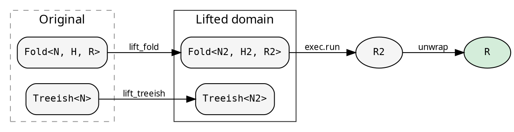
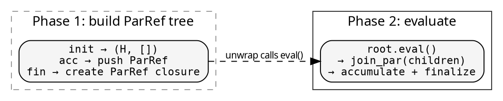
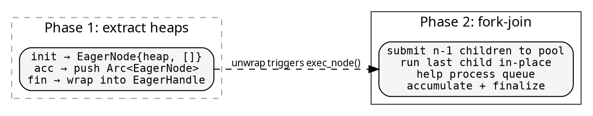

# Lifts: cross-cutting concerns

A Lift transforms both the Fold and Treeish into a different type
domain, runs the computation there, and maps the result back. The
caller gets the same `R` — the Lift is transparent.



Lifts are Shared-domain only — they clone Fold and Treeish (which
requires Arc-based types). Use `exec::FUSED.run_lifted(...)` or
any Shared-domain executor.

## Explainer — computation tracing

Records every step of the fold at every node: the initial heap,
each child result accumulated, and the final result. A histomorphism
— each node sees its subtree's full computation history.

```rust
use hylic::cata::exec::{self, Executor, ExecutorExt};
use hylic::prelude::Explainer;

// Transparent: get R, trace discarded
let r = exec::FUSED.run_lifted(&Explainer::lift(), &fold, &graph, &root);

// With callback: inspect trace at each node
let r = exec::FUSED.run_lifted(
    &Explainer::lift_with(|trace| eprintln!("trace: {:?}", trace)),
    &fold, &graph, &root,
);

// Zipped: get both R and the full ExplainerResult
let (r, trace) = exec::FUSED.run_lifted_zipped(
    &Explainer::lift(), &fold, &graph, &root
);
```

The `ExplainerResult` contains the original result plus the full
`ExplainerHeap` — initial heap, node, transitions (each with the
incoming child result and resulting heap state), and working heap.

Use the Explainer for debugging, visualization, or understanding
how a fold processes a specific tree.

## ParLazy — lazy parallel evaluation

Transforms the fold so each node's result is a `ParRef<R>` — a
lazy, memoized computation. Phase 1 builds the ParRef tree (cheap).
Phase 2 evaluates bottom-up via rayon's `par_iter`.

```rust
use hylic::prelude::ParLazy;

let r = exec::FUSED.run_lifted(&ParLazy::lift(), &fold, &graph, &root);
```



Best when: init is expensive (parallelized in Phase 2), accumulate
and finalize are cheap. The parallelism comes from rayon's `par_iter`
inside `ParRef::join_par`.

## ParEager — fork-join parallelism

Extracts heaps into an `EagerNode` tree (Phase 1), then executes
bottom-up with fork-join via a `WorkPool` (Phase 2).

```rust
use hylic::prelude::{ParEager, WorkPool, WorkPoolSpec};

WorkPool::with(WorkPoolSpec::threads(3), |pool| {
    exec::FUSED.run_lifted(&ParEager::lift(pool), &fold, &graph, &root)
});

// Convenience form:
ParEager::with(WorkPoolSpec::threads(3), |lift| {
    exec::FUSED.run_lifted(lift, &fold, &graph, &root)
});
```



Best when: you want explicit control over the thread pool (fixed
thread count, scoped lifecycle). The `WorkPool` uses `std::thread::scope`
— workers are guaranteed joined on return.

## Combining executors with Lifts

Any combination works — the executor controls Phase 1, the Lift
controls Phase 2:

| | exec::FUSED | exec::RAYON |
|---|---|---|
| ParLazy | Sequential build → rayon eval | Parallel build → rayon eval |
| ParEager | Sequential build → pool fork-join | Parallel build → pool fork-join |
| Explainer | Sequential trace | Parallel trace |

`exec::RAYON` + Lift = double parallelism: Phase 1 is parallel (rayon),
Phase 2 is also parallel (rayon or pool). This is useful for large
trees where both phases benefit from parallelism.

## Writing your own Lift

A Lift is four functions:

```rust
use hylic::cata::Lift;

let my_lift = Lift::new(
    |treeish| treeish,                      // lift_treeish: Treeish<N> → Treeish<N2>
    |fold| transform_fold(fold),            // lift_fold: Fold<N,H,R> → Fold<N2,H2,R2>
    |root| root.clone(),                    // lift_root: &N → N2
    |lifted_result| extract(lifted_result), // unwrap: R2 → R
);

let r = exec::FUSED.run_lifted(&my_lift, &fold, &graph, &root);
```

The key constraint: `unwrap(run(lift_fold(fold), lift_treeish(graph), lift_root(root)))`
must produce the same `R` as `run(fold, graph, root)`. The Lift is
transparent — it doesn't change the answer, only how it's computed.

Common patterns:
- **Identity treeish**: `|t| t` — don't change the tree, only the fold
- **Wrapping fold**: the fold's H2 contains the original H plus extra state
- **Deferred result**: R2 is a lazy handle (ParRef, EagerHandle) that
  produces R on unwrap
