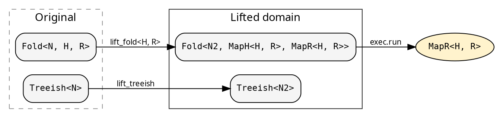

# Lifts: cross-cutting concerns

A lift transforms both the fold and the treeish into a different type
domain. The executor runs the lifted computation and returns
`MapR<H, R>` — the caller extracts the original result as needed.

The `Lift` trait defines three operations. The lifted heap and
result types are GATs (`MapH<H, R>`, `MapR<H, R>`), so each lift
determines how the `(H, R)` pair maps to its lifted counterpart
without requiring H or R as trait-level parameters:



## Explainer — computation tracing

The `Explainer` is a unit struct implementing `Lift<N, N>` for
all Clone types. It records every step of the fold at every node:
the initial heap, each child result accumulated, and the final result.
This is a histomorphism — each node sees its subtree's full
computation history.

```rust
{{#include ../../../src/docs_examples.rs:explainer_usage}}
```

The `ExplainerResult` contains the original result (`.orig_result`)
plus the full `ExplainerHeap` — initial state, node, transitions,
and working heap.

## The Lift trait

A lift provides three operations:

- **lift_treeish**: transform `Treeish<N>` → `Treeish<N2>`
- **lift_fold\<H, R\>**: transform `Fold<N, H, R>` → `Fold<N2, MapH<H, R>, MapR<H, R>>`
- **lift_root**: transform `&N` → `N2`

`lift_fold` is generic over H and R (the original fold's heap and
result types). The trait's GATs `MapH<H, R>` and `MapR<H, R>`
determine the lifted types per lift implementation — a bifunctor on
the `(H, R)` pair. H is bounded by `Clone + 'static` — lifts
inherently copy heap state between phases.

Concrete lifts implement `Lift` directly as structs. The Explainer
is a unit struct (no state). The `SeedLift` (used internally by
[`SeedPipeline`](./seed_pipeline.md)) carries a grow function.
Parallel lifts in the `hylic-parallel-lifts` crate carry pool
references. See [Implementing a custom lift](./implementing_lifts.md)
for the step-by-step pattern.

## Execution

`cata::lift::run_lifted` applies the three transformations and runs
the result through any Shared-domain executor:

```rust
use hylic::cata::lift;

// Returns ExplainerResult — access .orig_result for R
let trace = lift::run_lifted(&exec, &Explainer, &fold, &graph, &root);
```

H is inferred from the fold. The executor runs the lifted fold on the
lifted treeish and returns `MapR<H, R>`.

For the theoretical basis (algebra morphisms, how lifts relate to
Milewski's monoidal decomposition), see
[The N-H-R algebra factorization](../design/milewski.md).
