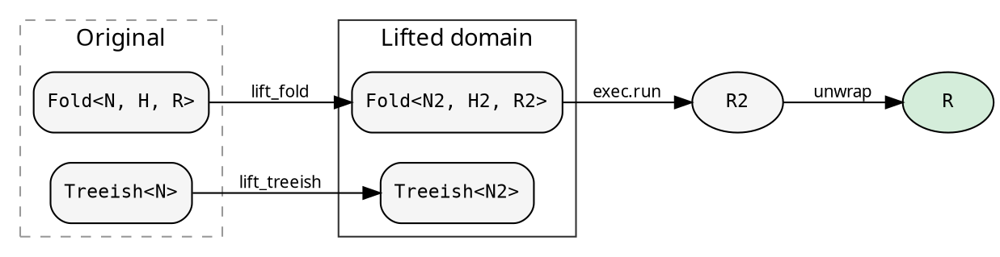

# Lifts: cross-cutting concerns

A Lift transforms both the Fold and Treeish into a different type
domain, runs the computation there, and maps the result back. The
caller gets the same `R` — the Lift is transparent.

<!-- -->



## Explainer — computation tracing

Records every step of the fold at every node: the initial heap,
each child result accumulated, and the final result. A histomorphism
— each node sees its subtree's full computation history.

```rust
{{#include ../../../src/docs_examples.rs:explainer_usage}}
```

The `ExplainerResult` contains the original result plus the full
`ExplainerHeap` — initial state, node, transitions (each with the
incoming child result and resulting heap state), and working heap.

Use the Explainer for debugging, visualization, or understanding
how a fold processes a specific tree.

## Parallel lifts (hylic-parallel-lifts)

Two parallel lift strategies are provided by the `hylic-parallel-lifts`
sibling crate:

**ParLazy** — two-pass parallel evaluation. Phase 1 builds a data
tree (heap values + child handles). Phase 2 evaluates bottom-up
via `fork_join_map` on a `WorkPool`. Best when init is expensive
relative to acc+fin.

**ParEager** — pipelined continuation-passing. Phase 1 wires a
continuation chain during the fused traversal. Leaf nodes submit
work to the pool immediately — Phase 2 starts during Phase 1.
Best when acc+fin are expensive.

Both are domain-generic (Shared and Local) via the data-tree
decoupling pattern: Phase 1 builds data nodes with no fold closures
captured. Phase 2 applies the fold through an external reference
(`SyncRef` for ParLazy, `FoldPtr` for ParEager).

## Writing your own Lift

A Lift is four functions:
`Lift::new(lift_treeish, lift_fold, lift_root, unwrap)`.

Common patterns:
- **Identity treeish**: `|t| t` — don't change the tree, only the fold
- **Wrapping heap**: H2 contains the original H plus extra state
- **Deferred result**: R2 is a handle that produces R on unwrap
- **Fold stash**: `Rc<RefCell<Option<fold>>>` to pass the fold from
  lift_fold to unwrap (both run on the caller's thread)

The Explainer in `prelude/` is the reference implementation.
See [Implementation notes](../design/implementation_notes.md) for
the internal mechanics.

## The mathematical picture

A Fold is an F-algebra: a function `F<R> → R` that collapses one
layer of structure. hylic decomposes it into three phases
(init/accumulate/finalize) through the intermediate heap type `H`.

A Lift is a natural transformation between two F-algebras. It maps
the carrier types `(H, R)` to `(H2, R2)` while preserving the
fold structure. The `unwrap` function projects back: `R2 → R`.
The computation produces the same result regardless of which
algebra it runs in — the Lift is transparent.
