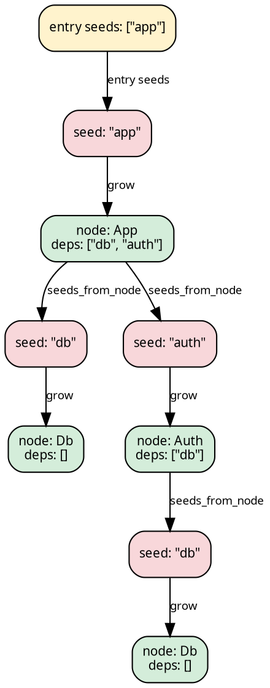

# Seed-based lazy discovery

In many recursive problems, the fold operates on resolved nodes (`N`)
but the dependency structure produces *references* — a module name, a
file path, a URL. These references are *seeds* of type `Seed`, not
nodes. A `grow` function bridges the gap: `Fn(&Seed) → N`.

The fold speaks `N`. The dependency graph speaks `Seed`. They're
different types with a morphism between them. `SeedPipeline`
reconciles this: it takes the user's natural primitives, composes
them into a treeish, and handles the entry transition. The user
provides:

- **`grow: Fn(&Seed) -> N`** — resolve a reference into a node
- **`seeds_from_node: Edgy<N, Seed>`** — given a resolved node, what
  are its dependency references? (`N → Seed*`)
- **`fold: FoldOps<N, H, R>`** — the algebra over resolved nodes

The pipeline constructs the `Treeish<N>` internally from
`seeds_from_node.map(grow)` — closing `N → Seed*` into `N → N*`.
Entry seeds are supplied at run time: the user calls
`.run(exec, entry_seeds, initial_heap)` with an `Edgy<(), Seed>`,
or `.run_from_slice(exec, &[seed1, seed2], initial_heap)`, and gets
`R`. See
[Algebra factorization: SeedPipeline](../design/milewski.md#bridging-coalgebra-and-algebra-seedpipeline)
for the theoretical basis.

## The pattern

Consider a module dependency resolver. Given a module name (a seed),
`grow` reads the file, parses it, and returns a module record (a
node) with its own dependency list (more seeds):



The fold runs bottom-up over the resolved nodes. At each node, `init`
extracts data, `accumulate` merges child results, `finalize` produces
the node's result. The seed layer is transparent — it passes each
child's result through unchanged.

Here is a concrete example. The modules are stored in a HashMap; each
module has a name and a list of dependency names (seeds). The fold
collects all reachable module names:

```rust
{{#include ../../../src/docs_examples.rs:seed_pipeline_example}}
```

## How it works internally

The coalgebra (`N → Seed*`) and the algebra (`FoldOps<N, H, R>`)
speak different types. The pipeline bridges them in two steps: first
compose the coalgebra into a proper treeish, then lift the entry
point.

An `Edgy<N, Seed>` is an edge function — node and edge types differ.
A `Treeish<N>` is `Edgy<N, N>` — node and edge types match. Closing
that gap is a single combinator:

```
seeds_from_node: Edgy<N, Seed>
    .map(grow)                              Seed → N
= Treeish<N>:    Edgy<N, N>
```

The treeish is then lifted into the `LiftedNode<Seed, N>` domain.
`LiftedNode` has three variants: `Entry` (the root branching point),
`Seed(s)` (an unresolved reference), and `Node(n)` (a resolved node).
The `SeedLift` constructs a `Treeish<LiftedNode<Seed, N>>` that
dispatches per variant:

```
Node(n)  → visit the original treeish, wrap each child as Node
Seed(s)  → produce one child: Node(grow(s))
Entry    → children come from the entry_seeds Edgy<(), Seed>, wrapped as Seed
```

The fold is lifted in parallel — `Node(n)` delegates to the original
init/accumulate/finalize via `LiftedHeap::Active(H)`;
`Seed(s)` is a transparent relay (`LiftedHeap::Relay`) that stores
and returns the single child's result; `Entry` accumulates
all seed results into the top-level heap.

At `.run()` time, the pipeline enters through `Entry`, which
fans out to `Seed(s)` for each entry seed, each of which grows
into `Node(n)`. The `LiftedNode` type is never visible to the user.

## Parallel execution

The pipeline accepts any executor at `.run()` time:

```rust
{{#include ../../../src/docs_examples.rs:seed_pipeline_parallel}}
```

## Derived pipelines

`SeedPipeline` supports `zipmap` and `map` for result-type
transformations, following the same pattern as fold transformations:

```rust
// Augment the result with an error count:
let with_errors = pipeline.zipmap(|names: &Vec<String>| {
    names.iter().filter(|n| n.starts_with("err_")).count()
});
// with_errors.run_from_slice(exec, &seeds, heap) returns (Vec<String>, usize)
```

SeedPipeline uses a [lift](./lifts.md) internally (SeedLift) to
handle the `LiftedNode<Seed, N>` type extension. The SeedLift's
relay heap, the three-variant dispatch, and the convergence property
are described in
[Implementing a custom lift](./implementing_lifts.md), which uses
SeedLift as the running example.
