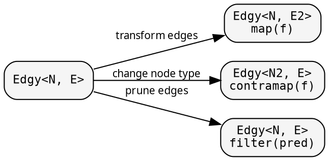

# Graph: controlling traversal

The graph — `Treeish<N>`, or the more general `Edgy<N, E>` — is a
function from a node to its children, and determines what is
visited during the fold. The node type `N` may be any type: a
struct, an integer index, a string key, a database identifier.
The structure of the tree resides in the function, not in the
data.

## Constructors

Three means of creating a `Treeish<N>`:

```rust
{{#include ../../../src/docs_examples.rs:treeish_constructors}}
```

`treeish_visit` is the most general form; its callback receives
each child without the allocation of a `Vec`. `treeish` wraps a
`Vec`-returning function for convenience, and `treeish_from`
extracts a slice reference from a field.

For non-nested data — adjacency lists, maps, external lookups —
`treeish_visit` is the appropriate constructor:

```rust,ignore
// Adjacency list: nodes are indices
let adj: Vec<Vec<usize>> = vec![vec![1, 2], vec![3], vec![], vec![]];
let graph = treeish_visit(move |n: &usize, cb: &mut dyn FnMut(&usize)| {
    for &c in &adj[*n] { cb(&c); }
});

// HashMap-backed graph: nodes are string keys
let edges: HashMap<String, Vec<String>> = /* ... */;
let graph = treeish_visit(move |n: &String, cb: &mut dyn FnMut(&String)| {
    if let Some(children) = edges.get(n) {
        for c in children { cb(c); }
    }
});
```

For a runnable adjacency-list example, see
[`intro_flat_example`](../intro.md#a-first-example).

## Edge transformations

The `Edgy<N, E>` type generalises `Treeish<N>` by allowing edges
and nodes to be different types. Combinators transform the edge
type or the node type:



### filter — pruning children

<!-- -->

```rust
{{#include ../../../src/docs_examples.rs:graph_filter}}
```

The fold sees fewer children without any awareness that pruning
has occurred.

## Caching: memoize_treeish

For DAGs in which the same node is reachable from multiple
parents, `memoize_treeish` caches the child enumeration:

```rust
{{#include ../../../src/docs_examples.rs:memoize_example}}
```

The first visit to a key computes and caches its children;
subsequent visits return the cached result.

## Visit combinator

`Edgy::at(node)` returns a `Visit<T, F>` — a push-based iterator
exposing `map`, `filter`, `fold`, `count`, and `collect_vec`. All
combinators are callback-based internally.
