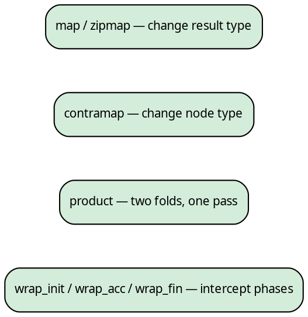
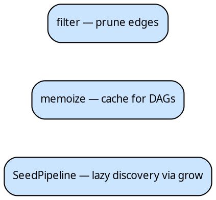
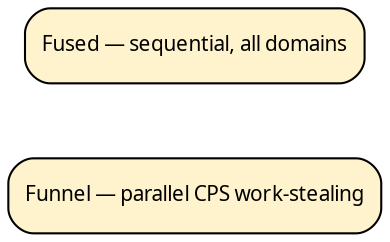

# hylic

A Rust library for composable recursive tree computation.

hylic separates a recursive computation into three independent
concerns: a *fold* that defines what to compute at each node, a
*graph* that describes the tree structure, and an *executor* that
controls how the recursion is carried out. Each concern can be
defined, transformed, and composed independently of the others.

```rust
use hylic::domain::shared as dom;
use hylic::graph;

#[derive(Clone)]
struct Dir { name: String, size: u64, children: Vec<Dir> }

let graph = graph::treeish(|d: &Dir| d.children.clone());
let fold = dom::simple_fold(
    |d: &Dir| d.size,
    |heap: &mut u64, child: &u64| *heap += child,
);

let tree = Dir {
    name: "project".into(), size: 10,
    children: vec![
        Dir { name: "src".into(), size: 200, children: vec![] },
        Dir { name: "docs".into(), size: 50, children: vec![] },
    ],
};

// Sequential:
let total = dom::FUSED.run(&fold, &graph, &tree);
assert_eq!(total, 260);

// Parallel — same fold, same graph:
use hylic::cata::exec::funnel;
let total = dom::exec(funnel::Spec::default(4)).run(&fold, &graph, &tree);
assert_eq!(total, 260);
```

The tree structure need not live inside the data. A `Treeish` is a
function from a node to its children — it can traverse a nested
struct, look up indices in a flat array, or resolve references
through any external mechanism. The same fold works regardless:

```rust
// Flat adjacency list — nodes are indices, children are looked up
let children: Vec<Vec<usize>> = vec![
    vec![1, 2],  // node 0 → children 1, 2
    vec![],      // node 1 → leaf
    vec![],      // node 2 → leaf
];
let graph = graph::treeish_visit(move |n: &usize, cb: &mut dyn FnMut(&usize)| {
    for &c in &children[*n] { cb(&c); }
});
let fold = dom::simple_fold(|n: &usize| *n as u64, |h: &mut u64, c: &u64| *h += c);

let total = dom::FUSED.run(&fold, &graph, &0);
assert_eq!(total, 3); // 0 + 1 + 2
```

## The three axes

A recursive tree computation decomposes along three orthogonal
dimensions. Changing one leaves the others untouched:

**Fold** — what to compute:



**Graph** — where the children are:



**Executor** — how to traverse:



The fold's three-phase structure (`init` → `accumulate` → `finalize`,
mediated by a heap type H) admits type-level transformations — `map`,
`contramap`, `product`, `zipmap`, phase wrapping — that compose
without modifying the original. The graph supports filtering,
contramap, and memoization for DAGs. The executor provides `.run()`
with the same interface whether it recurses on a single thread or
distributes subtrees across a work-stealing pool.

## Applications

The fold–graph–executor decomposition applies wherever a tree-shaped
structure is reduced bottom-up. The node type can be a nested struct,
an integer index into an array, a string key in a map, or a
reference resolved on demand through I/O. The [Cookbook](./cookbook/fibonacci.md)
includes worked examples:

**AST reduction.** An expression tree where each variant (add,
multiply, negate) combines children differently. The fold captures
the evaluation rules; the graph encodes the syntax tree as an enum.
See [Expression evaluation](./cookbook/expression_eval.md).

**Dependency resolution.** A module graph discovered lazily — each
module's dependencies are resolved on demand via a `grow` function.
Error nodes (parse failures, missing modules) become leaves. The
`SeedPipeline` encapsulates this as a lift. See
[Module resolution](./cookbook/module_resolution.md) and
[Entry points](./concepts/entry.md).

**Configuration inheritance.** Scoped settings that overlay
bottom-up — child scopes inherit and override parent values. See
[Configuration inheritance](./cookbook/config_inheritance.md).

**Multi-metric aggregation.** Several independent metrics (file
count, total size, maximum depth) computed in a single traversal
using the `product` combinator. See
[Filesystem summary](./cookbook/filesystem_summary.md).

**Graph validation.** Cycle detection in dependency graphs by
threading ancestor state through the node type. See
[Cycle detection](./cookbook/cycle_detection.md).

**Parallel tree processing.** The same fold and graph, executed
concurrently via the Funnel work-stealing engine. See
[Parallel execution](./cookbook/parallel_execution.md) and the
[Funnel executor](./funnel/overview.md).

## The parallel engine

The Funnel executor parallelizes a fused hylomorphism — the unfold
(tree discovery) and fold (bottom-up accumulation) interleave without
materializing the intermediate tree. Children beyond the first are
pushed to work-stealing queues; their results flow back through
defunctionalized continuations.

Three compile-time policy axes control queue topology (per-worker
deques vs shared queue), accumulation strategy (streaming sweep vs
bulk finalize), and wake policy (per-push, per-batch, every-K). All
sixteen combinations are monomorphized at compile time.

The accumulation sweep uses destructive reads: child results are
moved out of their slots during accumulation and freed immediately.
For folds that produce large intermediate results, the live memory
footprint is proportional to the tree's width rather than its total
size.

See [Funnel overview](./funnel/overview.md) and
[Policies](./funnel/policies.md).

## Lifts

A lift transforms both fold and treeish into a different type domain,
runs the computation there, and maps the result back. The `LiftOps`
trait uses GATs to express the type mapping without fixing the heap
type at the trait level.

The **Explainer** is a histomorphism lift that records the full
computation trace at every node. The **SeedLift** expresses
seed-based lazy graph discovery as a type-level fold transformation,
with transparent relay nodes that pass results through unchanged.

See [Lifts](./guides/lifts.md) and
[Transformations](./concepts/transforms.md).

## Where to start

The [Quick Start](./quickstart.md) walks through constructing and
running a fold. [The recursive pattern](./concepts/separation.md)
explains the underlying decomposition. The
[Cookbook](./cookbook/fibonacci.md) contains worked examples with
snapshot-tested output.
