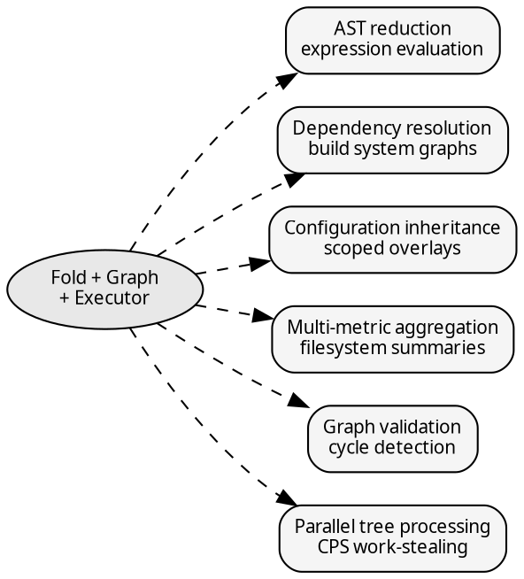

# hylic

A Rust library for composable recursive tree computation.

hylic separates a recursive computation into three independent
concerns: a *fold* that defines what to compute at each node, a
*graph* that describes the tree structure, and an *executor* that
controls how the recursion is carried out. Each concern can be
defined, transformed, and composed independently of the others.

```rust
use hylic::domain::shared as dom;
use hylic::graph;

#[derive(Clone)]
struct Dir { name: String, size: u64, children: Vec<Dir> }

let graph = graph::treeish(|d: &Dir| d.children.clone());
let fold = dom::simple_fold(
    |d: &Dir| d.size,
    |heap: &mut u64, child: &u64| *heap += child,
);

let tree = Dir {
    name: "project".into(), size: 10,
    children: vec![
        Dir { name: "src".into(), size: 200, children: vec![] },
        Dir { name: "docs".into(), size: 50, children: vec![] },
    ],
};

// Sequential execution:
let total = dom::FUSED.run(&fold, &graph, &tree);
assert_eq!(total, 260);

// Parallel execution — the fold and graph are unchanged:
use hylic::cata::exec::funnel;
let total = dom::exec(funnel::Spec::default(4)).run(&fold, &graph, &tree);
assert_eq!(total, 260);
```

The fold and graph remain the same across both invocations. Only
the executor changes.

## The three axes

A recursive tree computation decomposes along three orthogonal
dimensions. Changing one leaves the others untouched:

```dot process
digraph {
    rankdir=TB;
    node [shape=box, style="rounded,filled", fontname="sans-serif", fontsize=10];
    edge [fontname="sans-serif", fontsize=9];

    subgraph cluster_fold {
        label="Fold (what to compute)"; style=filled; fillcolor="#d4edda22"; color="#28a745";
        fontname="sans-serif"; fontsize=9;
        f1 [label="map / zipmap\nchange result type", fillcolor="#d4edda"];
        f2 [label="contramap\nchange node type", fillcolor="#d4edda"];
        f3 [label="product\ntwo folds, one pass", fillcolor="#d4edda"];
        f4 [label="wrap_init / wrap_acc / wrap_fin\nintercept phases", fillcolor="#d4edda"];
    }

    subgraph cluster_graph {
        label="Graph (where the children are)"; style=filled; fillcolor="#cce5ff22"; color="#004085";
        fontname="sans-serif"; fontsize=9;
        g1 [label="filter\nprune edges", fillcolor="#cce5ff"];
        g2 [label="memoize\ncache for DAGs", fillcolor="#cce5ff"];
        g3 [label="SeedPipeline\nlazy discovery", fillcolor="#cce5ff"];
    }

    subgraph cluster_exec {
        label="Executor (how to traverse)"; style=filled; fillcolor="#fff3cd22"; color="#856404";
        fontname="sans-serif"; fontsize=9;
        e1 [label="Fused\nsequential, all domains", fillcolor="#fff3cd"];
        e2 [label="Funnel\nCPS work-stealing", fillcolor="#fff3cd"];
    }
}
```



The fold's three-phase structure (`init` → `accumulate` → `finalize`,
mediated by a heap type H) admits a rich set of type-level
transformations — `map`, `contramap`, `product`, `zipmap`, phase
wrapping — that compose without modifying the original fold. The
graph supports filtering, contramap, and memoization for DAGs. The
executor provides `.run()` with the same signature regardless of
whether it recurses on a single thread or distributes subtrees across
a work-stealing pool.

## Applications

The fold–graph–executor decomposition applies to any computation
that reduces a tree-shaped structure bottom-up. The following
examples are included in the [Cookbook](./cookbook/fibonacci.md):



**AST reduction.** An expression tree where each node type combines
its children differently — addition, multiplication, conditionals.
The fold captures the evaluation rules; the graph captures the
syntax tree. See [Expression evaluation](./cookbook/expression_eval.md).

**Dependency resolution.** A module graph discovered lazily — each
module's dependencies are resolved on demand via a `grow` function.
Error nodes (parse failures, missing modules) are leaves. The
`SeedPipeline` encapsulates this pattern as a lift. See
[Module resolution](./cookbook/module_resolution.md) and
[Entry points](./concepts/entry.md).

**Configuration inheritance.** Scoped settings that overlay
bottom-up — child scopes inherit and override parent values. The
fold's accumulate phase merges dictionaries. See
[Configuration inheritance](./cookbook/config_inheritance.md).

**Multi-metric aggregation.** Computing several independent metrics
(file count, total size, maximum depth) in a single traversal. The
`product` combinator pairs two folds without double-visiting. See
[Filesystem summary](./cookbook/filesystem_summary.md).

**Graph validation.** Detecting cycles in dependency graphs by
threading ancestor state through the node type. The graph carries
the validation context; the fold is a standard accumulator. See
[Cycle detection](./cookbook/cycle_detection.md).

**Parallel tree processing.** The Funnel executor distributes
subtrees across a work-stealing pool using CPS (continuation-passing
style). The fold and graph are unchanged — parallelism is a property
of the executor, not the computation. See
[Parallel execution](./cookbook/parallel_execution.md) and the
[Funnel executor](./funnel/overview.md) documentation.

## The parallel engine

The Funnel executor parallelizes a fused hylomorphism — the unfold
(tree discovery) and fold (bottom-up accumulation) interleave without
materializing the intermediate tree. Children beyond the first are
pushed to work-stealing queues; their results flow back through
defunctionalized continuations.

Three compile-time policy axes control queue topology (per-worker
deques vs shared queue), accumulation strategy (streaming sweep vs
bulk finalize), and wake policy (per-push, per-batch, every-K). All
sixteen combinations are monomorphized — the policy selection has
no runtime cost.

The accumulation sweep uses destructive reads: child results are
moved out of their slots during accumulation and freed immediately.
For folds that produce large intermediate results (parsed documents,
aggregated datasets), the live memory footprint is proportional to
the tree's width rather than its total size.

See [Funnel overview](./funnel/overview.md) and
[Policies](./funnel/policies.md).

## Lifts

A lift transforms both fold and treeish into a different type domain,
runs the computation there, and maps the result back. The `LiftOps`
trait uses GATs to express the type mapping without fixing the heap
type at the trait level.

The **Explainer** is a histomorphism lift — it records the full
computation trace at every node (initial heap, each accumulated
child result, final state). The **SeedLift** expresses seed-based
lazy graph discovery as a type-level fold transformation, with
transparent relay nodes that pass results through unchanged.

See [Lifts](./guides/lifts.md) and
[Transformations](./concepts/transforms.md).

## Where to start

The [Quick Start](./quickstart.md) walks through constructing and
running a fold. [The recursive pattern](./concepts/separation.md)
explains the underlying decomposition. The
[Cookbook](./cookbook/fibonacci.md) contains worked examples with
snapshot-tested output.

Sources consulted for context on recursion schemes in Rust:
- [Practical recursion schemes in Rust (Tweag, 2025)](https://www.tweag.io/blog/2025-04-10-rust-recursion-schemes/)
- [Elegant and performant recursion in Rust (recursion.wtf)](https://recursion.wtf/posts/rust_schemes/)
- [Stalking a Hylomorphism in the Wild (Milewski)](https://bartoszmilewski.com/2017/12/29/stalking-a-hylomorphism-in-the-wild/)
