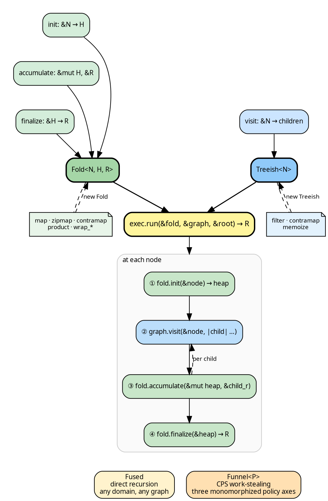
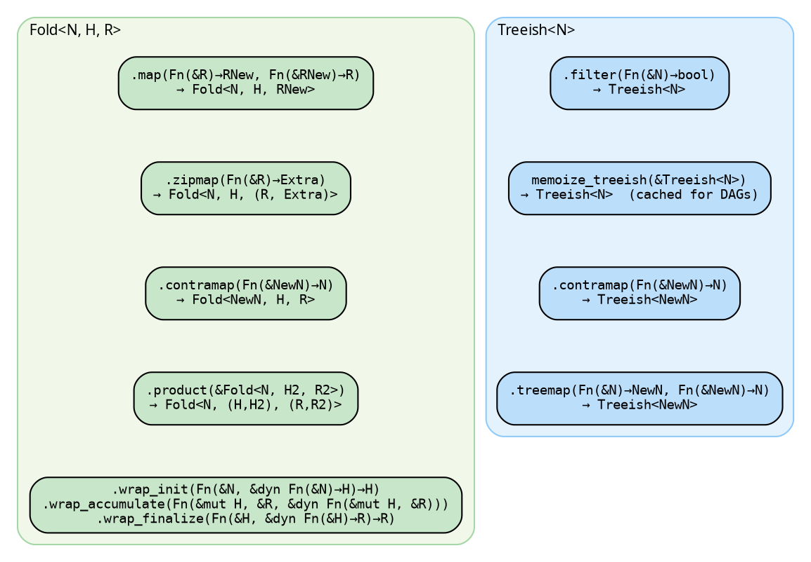

# hylic

A Rust library for composable recursive tree computation.

hylic separates a recursive computation into three independent
concerns: a **fold** that defines what to compute at each node, a
**graph** that describes the tree structure, and an **executor** that
controls how the recursion is carried out. Each concern can be
defined, transformed, and composed independently.

```rust
{{#include ../../src/docs_examples.rs:intro_dir_example}}
```

The tree structure need not live inside the data. A `Treeish` is a
function from a node to its children — it can traverse a nested
struct, look up indices in a flat array, or resolve references
through any external mechanism:

```rust
{{#include ../../src/docs_examples.rs:intro_flat_example}}
```

## Architecture

User-defined closures are wrapped into composable types (Fold,
Treeish), transformed independently, and handed to an executor. The
executor drives a recursion where fold and graph interleave at every
node:



- **`N`** — the node type (a struct, an index, a key — anything)
- **`H`** — the heap: per-node mutable scratch space, created by `init`, not shared between nodes
- **`R`** — the result: produced by `finalize`, flows upward to the parent's `accumulate`

Any fold and graph can be executed in parallel by switching to the
[Funnel executor](./funnel/overview.md) — a
[CPS work-stealing](./funnel/cps_walk.md) engine where unfold and fold
interleave without materializing the tree. Three
[compile-time policy axes](./funnel/policies.md) control
[queue topology](./funnel/queue_strategies.md),
[accumulation strategy](./funnel/accumulation.md), and
[wake policy](./funnel/pool_dispatch.md), all monomorphized to zero
dispatch overhead. Child results flow back through a
[packed-ticket FoldChain](./funnel/cascade.md) with
[destructive streaming sweeps](./funnel/accumulation.md) that free
intermediate memory progressively. See
[Benchmarks](./cookbook/benchmarks.md) for the performance
characteristics.

## Transformations and lifts

Folds and graphs are independently transformable. Each combinator
produces a new value — the original is unchanged (for Clone domains)
or consumed (for Owned):



- **`N`, `NewN`** — original and target node types
- **`H`** — the fold's per-node heap (unchanged by map/zipmap/contramap)
- **`R`, `RNew`, `Extra`** — original, replaced, and augmented result types

All compose freely — see the
[Fold guide](./guides/fold.md), [Graph guide](./guides/graph.md),
and [Transformations cookbook](./cookbook/transformations.md).

A [lift](./guides/lifts.md) goes further — it transforms both fold
and treeish in sync into a different type domain via the
[`LiftOps`](./concepts/transforms.md) trait. The
[Explainer](./concepts/transforms.md#explainer--computation-tracing)
records the full computation trace at every node (histomorphism).

[`SeedPipeline`](./guides/seed_pipeline.md) handles a common case:
the tree is discovered lazily from *seed* references rather than
known upfront. The user provides a seed edge function
(`Edgy<N, Seed>`) and a `grow` function (`Fn(&Seed) -> N`); the
pipeline constructs the treeish, handles the entry transition, and
runs the fold. Internally it uses a lift (`SeedLift`), but the
`LiftedNode<Seed, N>` type is hidden entirely.

## Cookbook

The [Cookbook](./cookbook/fibonacci.md) contains worked examples with
snapshot-tested output:
[expression evaluation](./cookbook/expression_eval.md),
[module resolution](./cookbook/module_resolution.md),
[configuration inheritance](./cookbook/config_inheritance.md),
[filesystem summary](./cookbook/filesystem_summary.md),
[cycle detection](./cookbook/cycle_detection.md),
[parallel execution](./cookbook/parallel_execution.md).

## Where to start

The [Quick Start](./quickstart.md) walks through constructing and
running a fold. [The recursive pattern](./concepts/separation.md)
explains the underlying decomposition.

## Further reading

- Meijer, Fokkinga, Paterson. *Functional Programming with Bananas, Lenses, Envelopes and Barbed Wire.* (1991) — the original recursion schemes paper.
- Milewski. [Monoidal Catamorphisms](https://bartoszmilewski.com/2020/06/15/monoidal-catamorphisms/) (2020) — a different algebra factorization. See [comparison](./design/milewski.md).
- Kmett. [recursion-schemes](https://hackage.haskell.org/package/recursion-schemes) — Haskell reference implementation.
- Malick. [recursion.wtf](https://recursion.wtf/) — practical recursion schemes in Rust.
