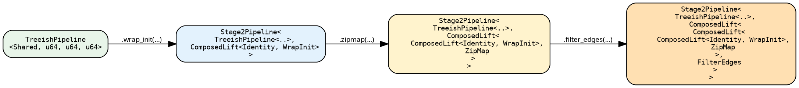

# Stage 2 — `Stage2Pipeline`

A `Stage2Pipeline<Base, L>` wraps a Stage-1 base (a `SeedPipeline` or
`TreeishPipeline`) with a chain of lifts:

```rust
{{#include ../../../../hylic-pipeline/src/stage2/pipeline.rs:stage2_pipeline_struct}}
```

Two fields. `base` is the Stage-1 source (or another `Stage2Pipeline` —
chains compose). `pre_lift` is one lift. The chain of lifts is *not* a
`Vec` — it's a single value of type `ComposedLift<Inner, Outer>`, a
right-associated tree. Each `.then_lift(...)` call (and every Stage-2
sugar) extends the tree by one node.

The chain's runtime input N depends on the Base:

- `Base = TreeishPipeline<…, N, …>` ⇒ chain operates over `N`.
- `Base = SeedPipeline<…, N, Seed, …>` ⇒ chain operates over `SeedNode<N>`,
  because [`SeedLift`](../concepts/lifts.md) is composed at the chain head
  at `.run` time. See [`SeedNode<N>`](./seednode.md) for the mechanics and
  for how the row is sealed against user code.

## How the type evolves

`Stage2Pipeline`'s type carries the entire chain shape. After three sugar
calls on a `TreeishPipeline<Shared, u64, u64, u64>`:



The base is unchanged; the lift tree grows outward. Recording the whole
chain at the type level is what lets the compiler verify each junction —
each lift's inputs must match the previous lift's outputs. In return,
every layer monomorphises and inlines together: no per-lift dispatch at
runtime, no per-lift allocation. The runtime cost of a deep type is
zero.

The cost is in error messages. A mismatched sugar surfaces the full
nested type. Such errors read inside-out — the `Inner` of the innermost
`ComposedLift` is the base; each surrounding layer is one `.then_lift`.

## Entering Stage 2

```text
let lp  = tree_pipeline.lift();   // Stage2Pipeline<TreeishPipeline<..>, IdentityLift>
let lsp = seed_pipeline.lift();   // Stage2Pipeline<SeedPipeline<..>,    IdentityLift>
```

Both sites produce the same `Stage2Pipeline` type, distinguished only by
their `Base`. `TreeishPipeline` also auto-lifts: `tree_pipeline.wrap_init(w)`
calls `.lift()` internally. `SeedPipeline` does not — `.lift()` must be
written explicitly, because the Stage-2 chain's N differs from the Stage-1
N (`SeedNode<N>` versus `N`), and an implicit transition would surface
that asymmetry in error messages without warning.

## The two primitives

### `then_lift` — append

```rust
{{#include ../../../../hylic-pipeline/src/stage2/primitives.rs:then_lift_primitive}}
```

`L2`'s inputs must match the chain tip's outputs. The new tip becomes
`(L2::N2, L2::MapH, L2::MapR)`.

`then_lift` is **unconstrained** at the struct-method level. Pure
construction. Validity is enforced where the chain is consumed —
`.run_from_node`, `.run`, the `TreeishSource` impl on the result. This is
a deliberate choice: chain-validity bounds belong at the consumption
boundary, not at every chain extension. The chain's deep type stays
buildable even when intermediate steps would not, on their own, be
runnable; the runnable check fires once, at `.run`.

### `before_lift` — prepend

```rust
{{#include ../../../../hylic-pipeline/src/stage2/primitives.rs:before_lift_primitive}}
```

Treeish-rooted only. Prepend `L0` before the existing chain. `L0` must be
type-preserving — its outputs must equal the Base's inputs, otherwise the
existing chain's first lift no longer has a matching input. This rules
out N-changing or H-changing pre-lifts; in practice `L0` is one of
`filter_edges_lift`, `wrap_visit_lift`, `memoize_by_lift`. For
axis-changing pre-adaptation, build the chain in the desired order with
`.then_lift` from the start.

Seed-rooted chains have no `before_lift`: the natural chain head is
`SeedLift` (composed at `.run` time), and there's no semantic position
"before" it. See the
[design notes](../design/pipeline_transformability.md#why-seedlift-is-composed-first-not-last).

## Sugars

Every Stage-2 sugar (`wrap_init`, `zipmap`, `map_n_bi`, `explain`, …)
delegates to `then_lift` with a library-built `ShapeLift`. The dispatch
that produces the correct lift for the chain's actual N (= `UN` or
`SeedNode<UN>`) lives in the [`Wrap` machinery](./wrap_dispatch.md). For
the user, sugars are typed at `&UN` regardless of Base; for the library,
the dispatch through `<<Base::Wrap as Wrap>::Of<UN>>` is the single
point where treeish-rooted and seed-rooted converge.

A representative sugar chain:

```rust
{{#include ../../../src/docs_examples.rs:lifted_sugar_chain}}
```

The chain-tip `R` is the type of the closure on the rightmost sugar — here
a `String`, set by `map_r_bi`. `run_from_node` returns that.

For the full sugar catalogue, see [Sugars](./sugars.md).

## Execution

For treeish-rooted chains, the result is a `TreeishSource`; the executor
takes it through `PipelineExec::run_from_node`:

```text
let r = lp.run_from_node(&FUSED, &root);
```

For seed-rooted chains, `.run` and `.run_from_slice` are inherent on
`Stage2Pipeline<SeedPipeline<…>, L>`. The library composes `SeedLift` at
the chain head from the captured `root_seeds` and `entry_heap`, then
dispatches:

```text
let r = lsp.run_from_slice(&FUSED, &[entry_seed], initial_heap);
```

The executor sees a single `(treeish, fold)` pair; the nested
`ComposedLift` is a compile-time record of how the pair was produced. For
the continuation-passing internals that make this resolution possible
without materialising intermediate pairs, see the
[Lifts chapter](../concepts/lifts.md#appendix-why-the-trait-takes-a-continuation).
