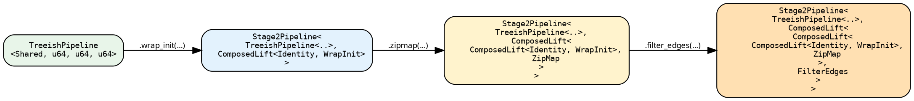
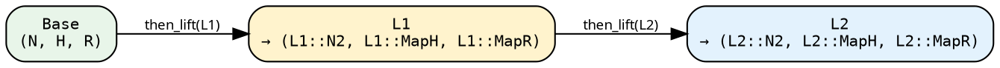

# Stage 2 — Stage2Pipeline

A `Stage2Pipeline<Base, L>` wraps a Stage-1 base (a `SeedPipeline` or
`TreeishPipeline`) with a **chain of lifts**, presenting the
resulting composition to the executor through the `TreeishSource`
trait — the executor itself makes no distinction between the two
stages.

```rust
{{#include ../../../../hylic-pipeline/src/stage2/pipeline.rs:stage2_pipeline_struct}}
```

There are two fields: the base — a Stage-1 source, or another
`Stage2Pipeline` — and a single `pre_lift: L`. The chain is not
represented as a `Vec<Lift>`; it is a single lift that happens to be
a `ComposedLift<Inner, Outer>` tree. Every `.then_lift(...)` call,
and every sugar invocation, extends that tree by one node.

The seed-pipeline-unification reduced the historical pair of Stage-2
types (`LiftedPipeline` and `LiftedSeedPipeline`) into the single
`Stage2Pipeline<Base, L>`. The two old names remain as deprecated
type aliases for one cycle:

```rust
#[deprecated] pub type LiftedPipeline<Base, L>     = Stage2Pipeline<Base, L>;
#[deprecated] pub type LiftedSeedPipeline<Base, L> = Stage2Pipeline<Base, L>;
```

## How the type evolves

A distinctive feature of `Stage2Pipeline` is that the type carries
the shape of the entire chain. Starting from a
`TreeishPipeline<D, N, H, R>`, after three sugar calls the type has
the following form:



The base remains unchanged; the lift tree grows outward, each sugar
call wrapping the previous lift in `ComposedLift<Previous, New>`.
The type must record the whole chain in order for the compiler to
verify every junction — each lift's inputs must match the preceding
lift's outputs. In return for the deep types, every layer
monomorphises and inlines together, and no per-lift dispatch remains
at runtime.

The ordering of sugar calls is type-significant — deliberately so. A
different ordering yields a different chain, and the compiler reports
a localised error when a later sugar expects outputs that an earlier
one does not produce.

## Entering Stage 2

```text
let lp  = tree_pipeline.lift();  // Stage2Pipeline<TreeishPipeline<..>, IdentityLift>
let lsp = seed_pipeline.lift();  // Stage2Pipeline<SeedPipeline<..>, IdentityLift>
```

Both forms produce the same `Stage2Pipeline` type, distinguished only
by their `Base`. The chain `L`'s node-axis differs:

- **Treeish-rooted** (`Base = TreeishPipeline<…>`): chain runs over
  the base node type `N`.
- **Seed-rooted** (`Base = SeedPipeline<…>`): chain runs over
  `SeedNode<N>`. The `SeedLift` is composed at run time as the
  natural chain head; user-facing sugars dispatch the `&N` parameter
  type via the `Wrap` trait so user closures still see plain `&N`
  for real Nodes (EntryRoot is handled internally).

For a `TreeishPipeline`, every Stage-2 sugar (`wrap_init`, `zipmap`,
`filter_edges`, …) also operates directly via auto-lifting: the
`LiftedSugarsShared` trait is blanket-implemented on
`TreeishPipeline` and on `Stage2Pipeline`, and its `then_lift` method
calls `.lift()` internally where needed. For a `SeedPipeline`,
auto-lifting is **not** provided — `.lift()` must be written
explicitly to enter Stage 2.

## The two primitives

### `then_lift` — post-compose

```rust
{{#include ../../../../hylic-pipeline/src/stage2/primitives.rs:then_lift_primitive}}
```

`L2`'s inputs must match the current chain tip's *outputs*. The new
tip type becomes `(L2::N2, L2::MapH, L2::MapR)`.



`then_lift` is unconstrained at construction (pure struct
manipulation); validity is enforced where the chain is consumed
(`.run_*`, `TreeishSource`). It builds a `ComposedLift<L, L2>` (see
[Lifts chapter](../concepts/lifts.md)).

### `before_lift` — pre-compose, type-preserving only

```rust
{{#include ../../../../hylic-pipeline/src/stage2/primitives.rs:before_lift_primitive}}
```

Prepends a lift before the existing chain. The existing chain already
expects specific input types (Base's N/H/R), so the prepended `L0`
must be **type-preserving** — its outputs must equal Base's inputs.
In practice that means `filter_edges_lift`, `wrap_visit_lift`, or
`memoize_by_lift`: lifts that don't change any axis.

For axis-selective pre-adaptation use the variance-aware constructors
(`map_n_bi_lift`, `map_r_bi_lift`, `n_lift`, `phases_lift`) and
compose them with `then_lift` instead.

`before_lift` is treeish-rooted-only — pre-composing before the
seed-rooted chain head (`SeedLift`) is not a sensible position.

## Chaining sugars in practice

Each Stage-2 sugar delegates to `then_lift` with a library-lift
constructor; see [sugars](./sugars.md) for the full catalogue.

```rust
{{#include ../../../src/docs_examples.rs:lifted_sugar_chain}}
```

The final `r` binding has type `String` because `map_r_bi` was the
last step; `run_from_node` returns the chain's tip `R`. Each sugar
call extends the chain by one `ComposedLift`; a type mismatch at any
junction — for example, a wrapper that expects a different `H` — is
reported as a localised compile error at the call site.

## Cost of the type nesting

The monomorphised chain inlines through every `ComposedLift` layer.
The runtime shape is a single tree walk that produces one
`(treeish, fold)` pair; the executor sees a plain
`Fold<N', H', R'>` at the end, without per-lift dispatch or per-lift
allocation.

The practical cost lies in diagnostics: a mismatched sugar call
surfaces the full nested type in the error message. Such errors are
read from the inside out — the `Inner` of the innermost
`ComposedLift` is the base, each surrounding layer represents one
`.then_lift`.

## Execution

For a treeish-rooted chain, `.run_from_node(&exec, &root)` resolves
the chain into a single `(treeish, fold)` pair and delegates to the
executor; the entry point is inherited from Stage 1 via
`TreeishSource`:

```text
let r = lp.run_from_node(&FUSED, &root);
```

For a seed-rooted chain, `.run` / `.run_from_slice` capture the
`root_seeds` and `entry_heap` at call time and synthesise the
`SeedLift` at the chain head before dispatching to the executor:

```text
let r = lsp.run_from_slice(&FUSED, &[entry_seed], initial_heap);
```

The executor ultimately receives the concrete
`(Treeish<N'>, Fold<N', H', R'>)` at the chain tip; the nested
`ComposedLift` is a compile-time record of how the pair was produced.

For the continuation-passing internals that make this resolution
possible without materialising intermediate pairs, see
[Lifts](../concepts/lifts.md#appendix-why-the-trait-takes-a-continuation).
