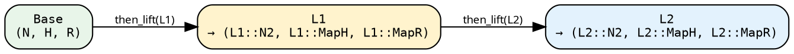

# Stage 2 — LiftedPipeline

A `LiftedPipeline` wraps a Stage-1 base (`SeedPipeline` or
`TreeishPipeline`) with a **lift chain**.

```rust
{{#include ../../../../hylic-pipeline/src/lifted/mod.rs:lifted_pipeline_struct}}
```

- **`base`** — the Stage-1 source (`SeedPipeline`, `TreeishPipeline`,
  or another LiftedPipeline).
- **`pre_lift: L`** — the chain of lifts sitting on top of the base.
  Starts as `IdentityLift` when you first call `.lift()`, grows by
  composition as you call `.then_lift(...)` or sugar methods.

## Entering Stage 2

```rust
let lp = seed_pipeline.lift();  // LiftedPipeline<SeedPipeline<..>, IdentityLift>
let lp = tree_pipeline.lift();  // LiftedPipeline<TreeishPipeline<..>, IdentityLift>
```

In practice you often skip the explicit `.lift()` — calling any
Stage-2 sugar (`wrap_init`, `zipmap`, etc.) on a Stage-1 pipeline
auto-lifts it.

## The two primitives

### `then_lift` — post-compose

```rust
{{#include ../../../../hylic-pipeline/src/lifted/primitives.rs:then_lift_primitive}}
```

Any `L2` whose *inputs* match the current chain tip's *outputs*
can be appended. The new chain tip is `L2`'s outputs.



Under the hood, `then_lift` builds a `ComposedLift<L, L2>` (see
[Lifts chapter](../concepts/lifts.md#composedliftl1-l2)).

### `before_lift` — pre-compose (type-preserving only)

```rust
{{#include ../../../../hylic-pipeline/src/lifted/primitives.rs:before_lift_primitive}}
```

`before_lift` prepends a lift before the existing chain. Because
the existing chain already expects specific input types (the
Base's N/H/R), the prepended `L0` must be **type-preserving** —
its outputs must equal Base's inputs.

Use cases: a `filter_edges_lift`, `wrap_visit_lift`, or
`memoize_by_lift` that should run before an already-constructed
N-change chain.

For axis-selective pre-adaptation use the variance-aware
constructors (`map_n_bi_lift`, `map_r_bi_lift`, `n_lift`,
`phases_lift`) and compose them with `then_lift`.

## Chaining sugars

Every Stage-2 sugar method is a one-liner over `then_lift` plus a
library-lift constructor. See [sugars](./sugars.md) for the full
catalogue. Example:

```rust
let lp = seed_pipeline
    .wrap_init(|n, orig| orig(n) + 1)       // = .then_lift(Shared::wrap_init_lift(w))
    .zipmap(|r| *r > 100)                    // = .then_lift(Shared::zipmap_lift(m))
    .filter_edges(|n| !n.is_empty())         // = .then_lift(Shared::filter_edges_lift(pred))
    .map_r_bi(to_string, from_string);       // = .then_lift(Shared::map_r_bi_lift(fwd, bwd))
```

Each step grows the chain by one `ComposedLift`. Type inference
walks the chain end-to-end, and Rust catches any type mismatch
(e.g. passing a wrapper that expects the wrong `H`) at the call
site.

## The chain is invisible to the executor

When you hit `.run_from_node(&exec, &root)` (or `.run(...)` for
Seed pipelines), the chain is applied in sequence: `apply` on
the outer lift, which calls `apply` on its inner, all the way
down to the base. The executor only sees the final
`(treeish, fold)` pair produced at the top of the stack.

This is what "CPS composition" buys you: deeply-nested lift
types that compile to a single pass at run time.

## Running it

Same entry points as Stage 1, inherited from `TreeishSource` /
`SeedSource`:

```rust
// Tree-rooted:
let r = lp.run_from_node(&FUSED, &root);

// Seed-rooted (if Base was a SeedPipeline):
let r = lp.run_from_slice(&FUSED, &[entry_seed], initial_heap);
```
