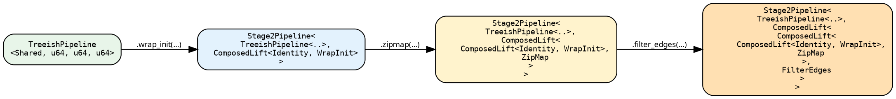

# Stage 2 — `Stage2Pipeline`

```rust
{{#include ../../../../hylic-pipeline/src/stage2/pipeline.rs:stage2_pipeline_struct}}
```

`base` is a Stage-1 pipeline. `pre_lift` is one lift value, but
typically a `ComposedLift<L1, L2>` tree built up through
`.then_lift` calls and Stage-2 sugars. Each sugar appends one
node to the tree.

The chain's input N is determined by the Base via the
[`Wrap`](./wrap_dispatch.md) projection on
[`Stage2Base`](./wrap_dispatch.md):

- `Base = TreeishPipeline<D, N, H, R>` — `Wrap::Of<N> = N`.
- `Base = SeedPipeline<D, N, Seed, H, R>` — `Wrap::Of<N> = SeedNode<N>`. `SeedLift` is composed at the chain head when `.run` is called; every stored lift in `pre_lift` sees `SeedNode<N>` as its input.

## Type evolution

After three sugars on a `TreeishPipeline<Shared, u64, u64, u64>`:



Each sugar wraps the previous chain in one more `ComposedLift`
layer. The base is unchanged. The whole chain monomorphises and
inlines together; there is no per-lift dispatch at runtime.

## Entering Stage 2

```rust
let lp  = tree_pipeline.lift();   // Stage2Pipeline<TreeishPipeline<..>, IdentityLift>
let lsp = seed_pipeline.lift();   // Stage2Pipeline<SeedPipeline<..>,    IdentityLift>
```

`TreeishPipeline` also auto-lifts: `tree_pipeline.wrap_init(w)`
calls `.lift()` internally. `SeedPipeline` does not — `.lift()`
must be written explicitly.

## Compositional primitives

### `then_lift` — append

```rust
{{#include ../../../../hylic-pipeline/src/stage2/primitives.rs:then_lift_primitive}}
```

`L2`'s inputs must match the chain tip's outputs. The new tip
becomes `(L2::N2, L2::MapH, L2::MapR)`. Available on every
`Stage2Pipeline<Base, L>`.

`then_lift` is unconstrained at the struct-method level (pure
construction). Validity is enforced where the chain is consumed
— the `.run*` methods and the `TreeishSource` impl.

### `before_lift` — prepend (treeish-rooted only)

```rust
{{#include ../../../../hylic-pipeline/src/stage2/primitives.rs:before_lift_primitive}}
```

Pre-compose `L0` at the head of the chain. `L0` must be
type-preserving — its outputs must equal the Base's inputs —
which restricts `L0` to lifts that don't change `(N, H, R)`
(`filter_edges_lift`, `wrap_visit_lift`, `memoize_by_lift` are
the practical choices).

Available only on `Stage2Pipeline<TreeishPipeline<…>, L>`.

## Sugars

Stage-2 sugars all delegate to `then_lift` after building a
`ShapeLift` through Wrap dispatch. The user's closures type at
`&UN` regardless of Base; the seed-rooted case adapts via a
`SeedNode::Node(_)`-peeling adapter inside the Wrap impl. Full
catalogue: [Sugars](./sugars.md). Type-level mechanism:
[Wrap dispatch](./wrap_dispatch.md).

```rust
{{#include ../../../src/docs_examples.rs:lifted_sugar_chain}}
```

## Running

`Stage2Pipeline` inherits run from its Stage-1 base.
Treeish-rooted: `.run_from_node(&exec, &root)` — see
[TreeishPipeline](./treeish.md#running). Seed-rooted:
`.run(&exec, root_seeds, entry_heap)` and
`.run_from_slice(&exec, &[seed], entry_heap)` — see
[SeedPipeline](./seed.md#running). The call shape is unchanged
across stages.
