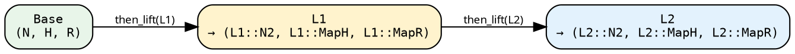

# Stage 2 — LiftedPipeline

A `LiftedPipeline` wraps a Stage-1 base (`SeedPipeline` or
`TreeishPipeline`) with a **lift chain**.

```rust
{{#include ../../../../hylic-pipeline/src/lifted/mod.rs:lifted_pipeline_struct}}
```

- **`base`** — the Stage-1 source (`SeedPipeline`, `TreeishPipeline`,
  or another LiftedPipeline).
- **`pre_lift: L`** — the chain of lifts sitting on top of the base.
  Starts as `IdentityLift` when you first call `.lift()`, grows by
  composition as you call `.then_lift(...)` or sugar methods.

## Entering Stage 2

```text
let lp = seed_pipeline.lift();  // LiftedPipeline<SeedPipeline<..>, IdentityLift>
let lp = tree_pipeline.lift();  // LiftedPipeline<TreeishPipeline<..>, IdentityLift>
```

Calling any Stage-2 sugar (`wrap_init`, `zipmap`, etc.) on a
Stage-1 pipeline auto-lifts, so the explicit `.lift()` is only
needed when you want to pass a raw `Lift` impl to `then_lift`.

## The two primitives

### `then_lift` — post-compose

```rust
{{#include ../../../../hylic-pipeline/src/lifted/primitives.rs:then_lift_primitive}}
```

Any `L2` whose *inputs* match the current chain tip's *outputs*
can be appended. The new chain tip is `L2`'s outputs.



`then_lift` builds a `ComposedLift<L, L2>` (see
[Lifts chapter](../concepts/lifts.md#composedliftl1-l2)).

### `before_lift` — pre-compose (type-preserving only)

```rust
{{#include ../../../../hylic-pipeline/src/lifted/primitives.rs:before_lift_primitive}}
```

`before_lift` prepends a lift before the existing chain. Because
the existing chain already expects specific input types (the
Base's N/H/R), the prepended `L0` must be **type-preserving** —
its outputs must equal Base's inputs.

Use cases: a `filter_edges_lift`, `wrap_visit_lift`, or
`memoize_by_lift` that should run before an already-constructed
N-change chain.

For axis-selective pre-adaptation use the variance-aware
constructors (`map_n_bi_lift`, `map_r_bi_lift`, `n_lift`,
`phases_lift`) and compose them with `then_lift`.

## Chaining sugars

Each Stage-2 sugar delegates to `then_lift` with a library-lift
constructor. See [sugars](./sugars.md) for the catalogue.

```rust
{{#include ../../../src/docs_examples.rs:lifted_sugar_chain}}
```

The `r` binding is `String` because `map_r_bi` was the last step;
`.run_from_node` returns the chain's tip R. Each step grows the
chain by one `ComposedLift`; a type mismatch at any join (e.g.
passing a wrapper expecting the wrong `H`) fails at the call site.

## Execution

`.run_from_node(&exec, &root)` walks the chain outer-to-inner via
CPS, producing the `(treeish, fold)` pair the executor sees. Same
entry points as Stage 1, inherited from `TreeishSource` /
`SeedSource`:

```text
// Tree-rooted:
let r = lp.run_from_node(&FUSED, &root);

// Seed-rooted (if Base was a SeedPipeline):
let r = lp.run_from_slice(&FUSED, &[entry_seed], initial_heap);
```
