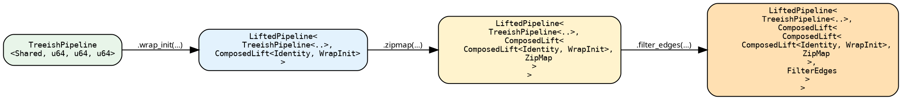
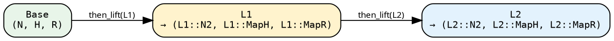

# Stage 2 — LiftedPipeline

A `LiftedPipeline` wraps a Stage-1 base (a `SeedPipeline` or
`TreeishPipeline`) with a **chain of lifts** and exposes it back
through the `TreeishSource` trait so executors don't know the
difference.

```rust
{{#include ../../../../hylic-pipeline/src/lifted/mod.rs:lifted_pipeline_struct}}
```

Two fields: the base (Stage-1 source, or another `LiftedPipeline`)
and a single `pre_lift: L`. The chain is not a `Vec<Lift>`; it's
one lift that happens to be a `ComposedLift<Inner, Outer>` tree.
Every `.then_lift(...)` or sugar call grows that tree by one node.

## How the type evolves

The interesting thing about `LiftedPipeline` is that the *type*
carries the entire chain shape. Start with a `TreeishPipeline<D,
N, H, R>`; after three sugar calls, the type looks like this:



The base stays constant. The lift tree grows outward: each new
sugar wraps the previous lift in `ComposedLift<Previous, New>`.
The type has to record the entire chain so the compiler can
verify each junction — each lift's inputs must match the previous
lift's outputs. In exchange for the deep types, every layer
monomorphises and inlines together; there is no per-lift dispatch
at runtime.

Sugar call ordering matters for the type, but that's the point:
changing the order changes the type chain, and the compiler
catches you if a later sugar expects outputs that an earlier one
doesn't produce.

## Entering Stage 2

```text
let lp = seed_pipeline.lift();  // LiftedPipeline<SeedPipeline<..>, IdentityLift>
let lp = tree_pipeline.lift();  // LiftedPipeline<TreeishPipeline<..>, IdentityLift>
```

Every Stage-2 sugar (`wrap_init`, `zipmap`, `filter_edges`, …)
works *directly* on a Stage-1 pipeline via auto-lifting — the
`LiftedSugarsShared` trait is blanket-implemented for Stage-1
sources, and its `then_lift` method calls `.lift()` under the
hood. Explicit `.lift()` is only necessary when you want to pass
a raw `Lift` impl to `then_lift` without going through a sugar.

## The two primitives

### `then_lift` — post-compose

```rust
{{#include ../../../../hylic-pipeline/src/lifted/primitives.rs:then_lift_primitive}}
```

`L2`'s inputs must match the current chain tip's *outputs*. The
new tip type becomes `(L2::N2, L2::MapH, L2::MapR)`.



`then_lift` builds a `ComposedLift<L, L2>` (see
[Lifts chapter](../concepts/lifts.md)).

### `before_lift` — pre-compose, type-preserving only

```rust
{{#include ../../../../hylic-pipeline/src/lifted/primitives.rs:before_lift_primitive}}
```

Prepends a lift before the existing chain. The existing chain
already expects specific input types (Base's N/H/R), so the
prepended `L0` must be **type-preserving** — its outputs must
equal Base's inputs. In practice that means `filter_edges_lift`,
`wrap_visit_lift`, or `memoize_by_lift`: lifts that don't change
any axis.

For axis-selective pre-adaptation use the variance-aware
constructors (`map_n_bi_lift`, `map_r_bi_lift`, `n_lift`,
`phases_lift`) and compose them with `then_lift` instead.

## Chaining sugars in practice

Each Stage-2 sugar delegates to `then_lift` with a library-lift
constructor. See [sugars](./sugars.md) for the full catalogue.

```rust
{{#include ../../../src/docs_examples.rs:lifted_sugar_chain}}
```

The final `r` binding is `String` because `map_r_bi` was the last
step; `run_from_node` returns the chain's tip `R`. Each step
grows the chain by one `ComposedLift`; a type mismatch at any
join (a wrapper expecting the wrong `H`, say) fails at the call
site with a localised compile error.

## Why the type nesting doesn't hurt

The monomorphised chain inlines through every `ComposedLift`
layer. The runtime shape is one tree walk producing one
`(treeish, fold)` pair; the executor sees a plain `Fold<N', H',
R'>` at the end. No per-lift dispatch, no per-lift allocation.

The ergonomic cost is diagnostics: a mismatched sugar call prints
the full nested type in the error message. Read them inside-out —
the `Inner` of the innermost `ComposedLift` is the base, each
outer layer is one `.then_lift`.

## Execution

`.run_from_node(&exec, &root)` resolves the chain into a single
`(treeish, fold)` pair and hands it to the executor. Same entry
points as Stage 1, inherited from `TreeishSource` / `SeedSource`:

```text
// Tree-rooted:
let r = lp.run_from_node(&FUSED, &root);

// Seed-rooted (if Base was a SeedPipeline):
let r = lp.run_from_slice(&FUSED, &[entry_seed], initial_heap);
```

Under the hood, the executor receives the concrete
`(Treeish<N'>, Fold<N', H', R'>)` at the chain tip — the nested
`ComposedLift` is just a compile-time record of how it was built.

For the continuation-passing internals that make this resolution
work without materialising intermediate pairs, see
[Lifts](../concepts/lifts.md).
