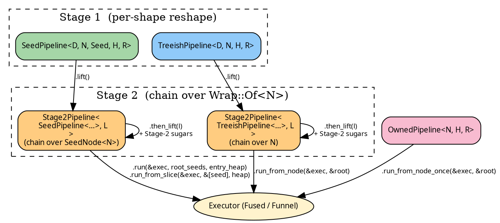

# Pipelines — overview

`hylic-pipeline` is a typestate builder over `hylic`'s lift
primitives. Three pipeline types sit behind the same builder
surface, distinguished by what they hold:

| Pipeline                                             | Slots                              | When to use |
|------------------------------------------------------|------------------------------------|-------------|
| [`SeedPipeline<D, N, Seed, H, R>`](./seed.md)        | `grow`, `seeds_from_node`, `fold`  | Tree is discovered lazily through a `Seed → N` resolver. Run from a forest of entry seeds. |
| [`TreeishPipeline<D, N, H, R>`](./treeish.md)        | `treeish`, `fold`                  | Children are enumerable directly from the node (`N → N*`). Run from a known root `&N`. |
| [`OwnedPipeline<N, H, R>`](./owned.md)               | `treeish`, `fold` (Owned domain)   | One-shot, by-value, no `Clone`. Run consumes `self`. |

Each pipeline is **Stage 1**: it stores its base slots and
exposes per-shape reshape sugars (e.g. `filter_seeds`,
`map_node_bi`, `wrap_grow`). Calling `.lift()` flips it into
**Stage 2**, where every method composes a lift onto the chain
held in `Stage2Pipeline<Base, L>`. `Stage2Pipeline` is one type
parameterised over which Stage-1 base is wrapped; the sugar
trait body covers both bases through [Wrap dispatch](./wrap_dispatch.md).

Run methods are owned by the pipeline that defines them:
`SeedPipeline::run` / `run_from_slice` in
[Stage 1 — SeedPipeline](./seed.md);
`PipelineExec::run_from_node` in
[Stage 1 — TreeishPipeline](./treeish.md);
`PipelineExecOnce::run_from_node_once` in
[OwnedPipeline](./owned.md). `Stage2Pipeline` inherits run from
its Stage-1 base.
