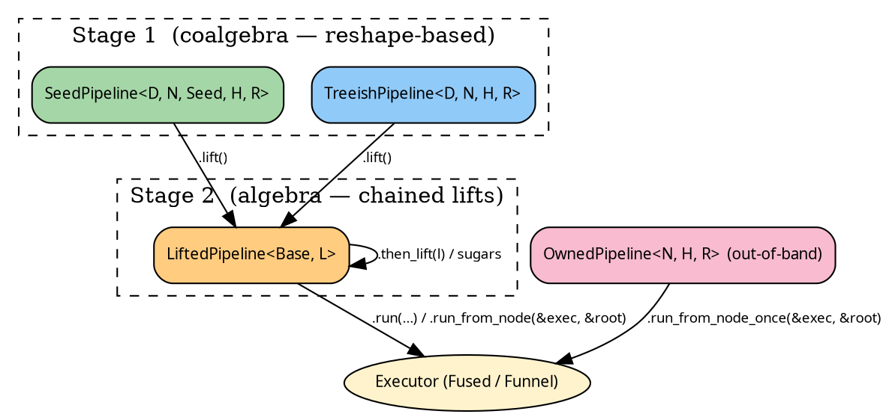

# Pipelines — overview

The `hylic-pipeline` crate is a typestate-pipeline library over
the lift primitives in `hylic`. At each stage, the available
methods match the shape of the thing being built:

- A builder surface (`.wrap_init(...).zipmap(...)`).
- Two typestate boundaries (Stage 1 → Stage 2 via `.lift()`).
- `SeedPipeline::run(...)` composes `SeedLift` onto the chain to
  close the grow axis.

Compared to bare
[`LiftBare::run_on`](../concepts/lifts.md#applying-a-lift-without-a-pipeline),
pipelines trade a little indirection for chainable method syntax
and a typestate that names where you are.



## Which pipeline do I pick?

| You have…                                                    | Use                    |
|--------------------------------------------------------------|------------------------|
| `Seed → N` grow + `N → Seed*` children, run from entry seeds | `SeedPipeline` (Stage 1) |
| `N → N*` children directly (already a tree), run from a root | `TreeishPipeline` (Stage 1) |
| An existing Stage-1 pipeline you want to post-compose a lift onto | `.lift()` → `LiftedPipeline` (Stage 2) |
| One-shot, no Clone                                           | `OwnedPipeline` (out-of-band) |

## The two stages

**Stage 1** holds the base slots directly — a coalgebra. Transforms
are reshapes of those slots: `filter_seeds`, `wrap_grow`,
`map_node_bi`, `map_seed_bi`.

**Stage 2** stacks lifts on top of a Stage-1 base. Transforms
compose ShapeLifts onto the chain: `wrap_init`, `zipmap`,
`map_r_bi`, `memoize_by`, `explain`.

`.lift()` crosses the boundary; Stage-2 sugars can then be
chained. Stage-1 pipelines also expose Stage-2 sugars via
auto-lift: `seed_pipeline.wrap_init(w)` lifts and composes in
one call.

## Running a pipeline

The run entry points, from the `source.rs` interface traits:

- `TreeishSource::with_treeish(cont)` — yields `(treeish, fold)`
  to `cont`. Internal; callers use `PipelineExec::run_from_node`.
- `PipelineExec::run_from_node(&exec, &root)` — execute from a
  known root node. All pipelines get this via blanket impl once
  they're `TreeishSource`.
- `PipelineExecSeed::run(&exec, entry_seeds, entry_heap)` —
  execute a Seed-rooted pipeline. Only `SeedSource` pipelines get
  this; internally composes `SeedLift` to close the grow axis.
- `PipelineExecSeed::run_from_slice(&exec, &[s1, s2], entry_heap)`
  — convenience sugar over `run`.

## Example shape of a pipeline

Two small worked examples — a TreeishPipeline starting from a root
`Node`, and a SeedPipeline starting from a module name `String`
that `grow` resolves via a registry:

```rust
{{#include ../../../src/docs_examples.rs:pipeline_overview_treeish}}
```

`.run_from_node` returns the tip R of the chain — here
`(u64, bool)` after the `.zipmap(|r: &u64| *r > 5)`.

```rust
{{#include ../../../src/docs_examples.rs:pipeline_overview_seed}}
```

From here:

- [Stage 1 — SeedPipeline](./seed.md)
- [Stage 1 — TreeishPipeline](./treeish.md)
- [Stage 2 — LiftedPipeline](./lifted.md)
- [Blanket sugar traits](./sugars.md)
- [One-shot — OwnedPipeline](./owned.md)
- [Writing a custom Lift](./custom_lift.md)
- [Case study — Explainer](./explainer.md)
