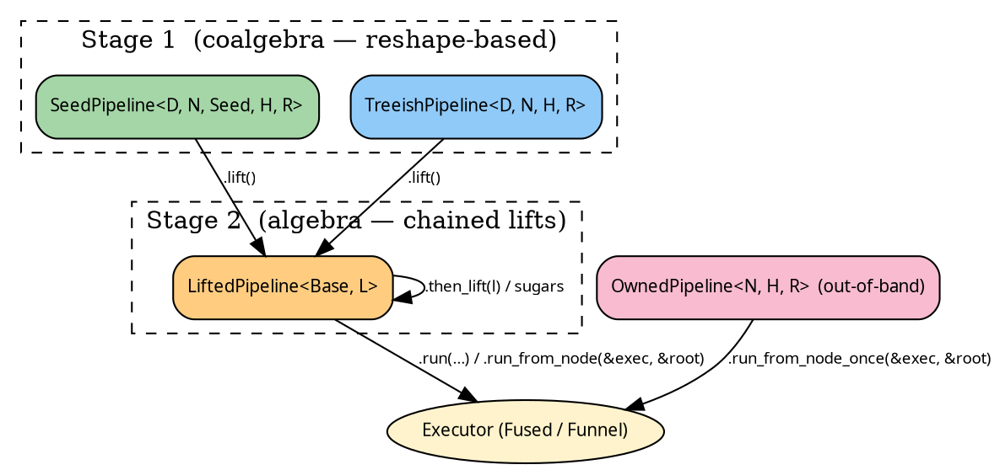

# Pipelines — overview

The `hylic-pipeline` crate provides a typestate-driven builder
over the lift primitives defined in `hylic`. Each stage exposes
methods consistent with what is being constructed at that stage:

- a builder surface (`.wrap_init(...).zipmap(...)`),
- two typestate boundaries (Stage 1 → Stage 2 via `.lift()`),
- `SeedPipeline::run(...)`, which composes `SeedLift` onto the
  chain to close the grow axis.

Compared to
[bare lift application](#alternative-bare-lift-application) — a
single `LiftBare::run_on` call over a `(treeish, fold)` pair —
pipelines accept a small amount of indirection in return for
chainable method syntax and a typestate that records the current
stage.



## Choosing a pipeline

| Situation                                                          | Pipeline |
|--------------------------------------------------------------------|----------|
| `Seed → N` grow plus `N → Seed*` children, run from entry seeds    | `SeedPipeline` (Stage 1) |
| `N → N*` children directly (tree already in hand), run from a root | `TreeishPipeline` (Stage 1) |
| An existing Stage-1 pipeline onto which lifts are to be composed   | `.lift()` → `LiftedPipeline` (Stage 2) |
| A one-shot computation without `Clone`                             | `OwnedPipeline` (out-of-band) |

## The two stages

**Stage 1** retains the base slots directly — a coalgebraic form.
Transforms at Stage 1 reshape those slots: `filter_seeds`,
`wrap_grow`, `map_node_bi`, `map_seed_bi`.

**Stage 2** stacks lifts on top of a Stage-1 base. Transforms at
Stage 2 compose `ShapeLift`s onto the chain: `wrap_init`,
`zipmap`, `map_r_bi`, `memoize_by`, `explain`.

`.lift()` moves a pipeline across the boundary; Stage-2 sugars
may then be chained. Stage-1 pipelines also expose Stage-2 sugars
via auto-lifting: `seed_pipeline.wrap_init(w)` lifts the pipeline
and composes the sugar in a single call.

## Running a pipeline

The run entry points, from the `source.rs` interface traits:

- `TreeishSource::with_treeish(cont)` — yields `(treeish, fold)`
  to `cont`. Internal; callers use `PipelineExec::run_from_node`.
- `PipelineExec::run_from_node(&exec, &root)` — execute from a
  known root node. All pipelines get this via blanket impl once
  they're `TreeishSource`.
- `PipelineExecSeed::run(&exec, entry_seeds, entry_heap)` —
  execute a Seed-rooted pipeline. Only `SeedSource` pipelines get
  this; internally composes `SeedLift` to close the grow axis.
- `PipelineExecSeed::run_from_slice(&exec, &[s1, s2], entry_heap)`
  — convenience sugar over `run`.

## Example shape of a pipeline

Two small worked examples — a TreeishPipeline starting from a root
`Node`, and a SeedPipeline starting from a module name `String`
that `grow` resolves via a registry:

```rust
{{#include ../../../src/docs_examples.rs:pipeline_overview_treeish}}
```

`.run_from_node` returns the tip R of the chain — here
`(u64, bool)` after the `.zipmap(|r: &u64| *r > 5)`.

```rust
{{#include ../../../src/docs_examples.rs:pipeline_overview_seed}}
```

## Alternative: bare lift application

The pipeline crate is not required in order to apply a lift. Any
`Lift` implementation may be applied directly to a bare
`(treeish, fold)` pair via the `LiftBare` blanket trait in
`hylic`:

```rust
{{#include ../../../../hylic/src/ops/lift/bare.rs:lift_bare_trait}}
```

The trait provides two methods:

- **`apply_bare(treeish, fold)`** — returns the transformed
  `(treeish', fold')` pair, which may then be run under any
  executor.
- **`run_on(exec, treeish, fold, root)`** — apply and run in one
  call. Returns the lift's `MapR`.

```rust
{{#include ../../../src/docs_examples.rs:bare_lift_wrap_init}}
```

Bare application is preferable when:

- **Only a single lift is to be applied** — the pipeline
  machinery adds no value.
- **A library built on hylic** wishes to retain a narrow
  dependency surface — the `hylic` crate alone is sufficient.
- **Parallel lifts are being benchmarked.** `ParLazy` and
  `ParEager` from `hylic-parallel-lifts` are `Lift`
  implementations; `run_on` measures them without the pipeline
  in the middle.

Composition without a pipeline is available via
`ComposedLift::compose`:

```rust
{{#include ../../../src/docs_examples.rs:bare_lift_composed}}
```

Stage-2 `.then_lift(...)` calls the same primitive internally.

### The panic-grow

`Lift::apply` takes `(grow, treeish, fold)`; the bare path has
no grow, since execution begins from `&root`. `LiftBare::apply_bare`
synthesises one:

```text
let panic_grow = <D as Domain<N>>::make_grow::<(), N>(|_: &()| {
    unreachable!("LiftBare::apply_bare synthesises a panic-grow; no Lift impl invokes grow at runtime")
});
self.apply::<(), _>(panic_grow, treeish, fold, |_g, t, f| (t, f))
```

No library `Lift` implementation reads `grow` at runtime —
`SeedLift` is the only one that does, and `SeedLift` does not
run under `apply_bare`. A custom Lift that did read `grow` would
panic here, making the omission visible rather than silently
computing a wrong result.

## From here

- [Stage 1 — SeedPipeline](./seed.md)
- [Stage 1 — TreeishPipeline](./treeish.md)
- [Stage 2 — LiftedPipeline](./lifted.md)
- [Blanket sugar traits](./sugars.md)
- [One-shot — OwnedPipeline](./owned.md)
- [Writing a custom Lift](./custom_lift.md)
- [Cookbook: Explainer case study](../cookbook/explainer.md)
