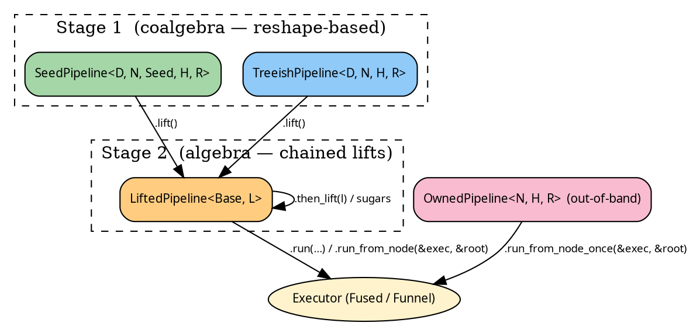

# Pipelines — overview

The `hylic-pipeline` crate gives you typestate pipelines: a
stateful builder where the operations available at each step
match the shape of the thing being built. Compared to bare
[`LiftBare::run_on`](../concepts/lifts.md#applying-a-lift-without-a-pipeline),
pipelines add:

- A fluent, chainable surface (`.wrap_init(...).zipmap(...)`).
- Explicit typestate boundaries (`SeedPipeline.lift() →
  LiftedPipeline`).
- Auto-dispatch of the right finishing lift when you hit `.run(...)`.



## Which pipeline do I pick?

| You have…                                                    | Use                    |
|--------------------------------------------------------------|------------------------|
| `Seed → N` grow + `N → Seed*` children, run from entry seeds | `SeedPipeline` (Stage 1) |
| `N → N*` children directly (already a tree), run from a root | `TreeishPipeline` (Stage 1) |
| An existing Stage-1 pipeline you want to post-compose a lift onto | `.lift()` → `LiftedPipeline` (Stage 2) |
| One-shot, zero-overhead, never cloning                       | `OwnedPipeline` (out-of-band) |

## Typestate in 30 seconds

**Stage 1** is a coalgebra: you describe the shape of the
computation (how to grow, how children relate, what to fold).
Transforms at Stage 1 are **reshapes** — they change the base
slots in place (`filter_seeds`, `wrap_grow`, `map_node_bi`, …).

**Stage 2** is an algebra: a lift chain sits on top of the
Stage-1 base. Transforms at Stage 2 are **lift compositions** —
they stack ShapeLifts on top of the base
(`wrap_init`, `zipmap`, `map_r_bi`, `memoize_by`, `explain`, …).

The typestate enforces the order: you `.lift()` once to cross the
boundary, then chain Stage-2 sugars freely.

Stage-1 pipelines also expose Stage-2 sugars via auto-lift:
calling `seed_pipeline.wrap_init(w)` on a `SeedPipeline` implicitly
lifts it and composes `wrap_init` — no `.lift()` keyword needed.

## Running a pipeline

The run entry points, from the `source.rs` interface traits:

- `TreeishSource::with_treeish(cont)` — yields `(treeish, fold)`
  to `cont`. Internal; callers use `PipelineExec::run_from_node`.
- `PipelineExec::run_from_node(&exec, &root)` — execute from a
  known root node. All pipelines get this via blanket impl once
  they're `TreeishSource`.
- `PipelineExecSeed::run(&exec, entry_seeds, entry_heap)` —
  execute a Seed-rooted pipeline. Only `SeedSource` pipelines get
  this; internally composes `SeedLift` to close the grow axis.
- `PipelineExecSeed::run_from_slice(&exec, &[s1, s2], entry_heap)`
  — convenience sugar over `run`.

## Example shape of a pipeline

Two small worked examples — a TreeishPipeline starting from a root
`Node`, and a SeedPipeline starting from a module name `String`
that `grow` resolves via a registry:

```rust
{{#include ../../../src/docs_examples.rs:pipeline_overview_treeish}}
```

**Note the return type:** after `.zipmap(|r| *r > 5)`, the chain's
tip R is `(u64, bool)` — each Stage-2 sugar's output R becomes
the new tip, and `.run_from_node(...)` returns **exactly that**.
No back-mapping to the original R.

```rust
{{#include ../../../src/docs_examples.rs:pipeline_overview_seed}}
```

From here:

- [Stage 1 — SeedPipeline](./seed.md)
- [Stage 1 — TreeishPipeline](./treeish.md)
- [Stage 2 — LiftedPipeline](./lifted.md)
- [Blanket sugar traits](./sugars.md)
- [One-shot — OwnedPipeline](./owned.md)
- [Writing a custom Lift](./custom_lift.md)
- [Case study — Explainer](./explainer.md)
