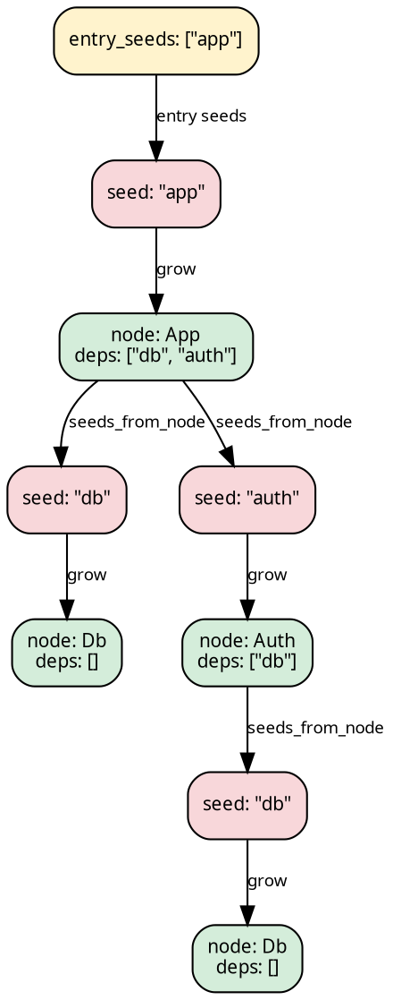

# Stage 1 — `SeedPipeline`

A `SeedPipeline` carries three base slots — a coalgebra plus an algebra:

```rust
{{#include ../../../../hylic-pipeline/src/seed/mod.rs:seed_pipeline_struct}}
```

- **`grow: Seed → N`** — resolves a reference (a `Seed`) into a
  full node (`N`).
- **`seeds_from_node: Edgy<N, Seed>`** — given a resolved node,
  enumerates the references it points to.
- **`fold: Fold<N, H, R>`** — the algebra over resolved nodes.

The pipeline operates lazily on demand: given an entry seed at run time,
it grows the tree by alternating `grow` and `seeds_from_node` until each
branch terminates at a leaf.



## When to pick this over `TreeishPipeline`

Use `SeedPipeline` when the dependency graph speaks a different language
from the nodes — file paths, module names, URLs, anything that must be
resolved into a full data structure before its children can be examined.
When the nodes themselves already enumerate their children directly
(`N → N*`), [`TreeishPipeline`](./treeish.md) is simpler: no grow slot.

## Constructing one

```rust
{{#include ../../../src/docs_examples.rs:pipeline_overview_seed}}
```

## Stage-1 reshape

A `SeedPipeline` can be reshaped without lifting — the result is still a
`SeedPipeline` of (possibly different) type parameters. The
[`SeedSugarsShared`](./sugars.md#stage-1--seedsugarsshared--seedsugarslocal)
trait provides the surface; `SeedSugarsLocal` mirrors it for the Local
domain. Both come into scope via `use hylic_pipeline::prelude::*;`.

| method                    | changes                                    |
|---------------------------|--------------------------------------------|
| `filter_seeds(pred)`      | `Seed` set narrowed; types preserved       |
| `wrap_grow(w)`            | intercepts every grow; types preserved     |
| `map_node_bi(co, contra)` | changes N to N2 via bijection              |
| `map_seed_bi(to, from)`   | changes Seed to Seed2 via bijection        |

## Transitioning to Stage 2

Stage-2 sugars are **not** available on `SeedPipeline` directly — an
explicit `.lift()` is required. (TreeishPipeline auto-lifts; SeedPipeline
does not, because the Stage-2 chain operates over `SeedNode<N>` rather
than `N`, and an implicit transition would surface that asymmetry in
error messages.)

```text
let lsp = pipeline
    .lift()                              // → Stage2Pipeline<SeedPipeline<…>, IdentityLift>
    .wrap_init(|n: &N, orig| orig(n) + 1)
    .zipmap(|r: &R| classify(r));        // chain extends; tip R becomes (R, classification)
```

After `.lift()`, the chain operates on `SeedNode<N>` — but every Stage-2
sugar's user closure types at `&N`. The `SeedNode` row is sealed and
auto-dispatched; see [`SeedNode<N>`](./seednode.md) for the row's shape
and the rare cases where it surfaces in a chain-tip type, and
[Wrap dispatch](./wrap_dispatch.md) for how the sugar trait reaches both
Bases through one body.

## Running

`.run` and `.run_from_slice` are inherent on the seed-rooted
`Stage2Pipeline<SeedPipeline<…>, L>`. The Stage-1 `SeedPipeline` itself
is not runnable — `.lift()` must come first even when no sugar is applied:

```text
// Entry seeds as a slice (convenience):
let r: u64 = pipeline
    .lift()
    .run_from_slice(&FUSED, &["app".to_string()], 0u64);

// Entry seeds as a general Edgy<(), Seed>:
let entry = edgy_visit(|_: &(), cb| cb(&"app".to_string()));
let r: u64 = pipeline.lift().run(&FUSED, entry, 0u64);
```

The third argument is the initial heap at the synthetic root level —
what the top-level accumulator starts with before any seed's result is
folded in. It is always the **base** `H` type; the chain's own `MapH`
is reached internally as the sugars promote from `H` outward.

## Full example

```rust
{{#include ../../../src/docs_examples.rs:seed_pipeline_example}}
```
