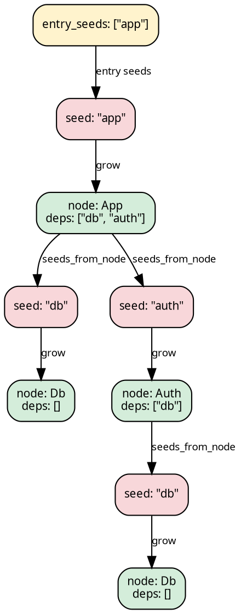

# Stage 1 — SeedPipeline

A `SeedPipeline` carries three base slots:

```rust
{{#include ../../../../hylic-pipeline/src/seed/mod.rs:seed_pipeline_struct}}
```

- **`grow: Seed → N`** — resolves a reference (a `Seed`) into a
  full node (`N`).
- **`seeds_from_node: Edgy<N, Seed>`** — given a resolved node,
  enumerates the references it points to.
- **`fold: Fold<N, H, R>`** — the algebra over resolved nodes.

The pipeline operates lazily on demand: given a reference (a
`Seed`) at run time, it grows the tree by alternating `grow` and
`seeds_from_node` until each branch terminates at a leaf.



## When to pick this over TreeishPipeline

Use `SeedPipeline` when the dependency graph speaks a different
language from the nodes — file paths, module names, URLs, or any
reference that must be resolved into a full data structure
before its children can be examined.

When the nodes themselves already enumerate their children as
nodes of the same type (`N → N*`), [TreeishPipeline](./treeish.md)
is simpler: no grow slot is needed.

## Constructing one

```rust
{{#include ../../../src/docs_examples.rs:pipeline_overview_seed}}
```

## Stage-1 reshapes (inherent methods)

A SeedPipeline can be reshaped without lifting — the result is
still a SeedPipeline of (possibly different) type parameters:

| method                   | changes                                      |
|--------------------------|----------------------------------------------|
| `filter_seeds(pred)`     | `Seed` set narrowed; types preserved         |
| `wrap_grow(w)`           | intercepts every grow; types preserved       |
| `map_node_bi(co, contra)` | changes N to N2 via bijection               |
| `map_seed_bi(to, from)`  | changes Seed to Seed2 via bijection          |

These are provided by the [`SeedSugarsShared`](./sugars.md) trait
(and `SeedSugarsLocal` for the Local domain) — they come into
scope via `use hylic_pipeline::prelude::*;`.

## Transitioning to Stage 2

Stage-2 sugars are available on a `SeedPipeline` directly,
through auto-lifting: any call to `.wrap_init(w)`, `.zipmap(m)`,
and similar methods implicitly lifts the pipeline and composes
the sugar.

```text
// auto-lifting shape (pseudocode):
let lifted = pipeline
    .wrap_init(|n, orig| orig(n) + 1)     // auto-lifts here
    .zipmap(|r| *r > 100);                 // chains further
// `lifted` is a LiftedPipeline<…, …> with tip R = (u64, bool).
```

An explicit lift — useful, for instance, when passing a raw
`Lift` implementation to `then_lift` — is obtained via `.lift()`:

```text
let lp = pipeline.lift();           // LiftedPipeline<SeedPipeline<...>, IdentityLift>
let lp = lp.then_lift(my_custom_lift);
```

## Running it

Two entry points, both via the `PipelineExecSeed` trait:

```text
// Entry seeds as a slice (convenience):
let r: u64 = pipeline
    .run_from_slice(&FUSED, &["app".to_string()], 0u64);

// Entry seeds as a general Edgy<(), Seed>:
let entry: Edgy<(), String> =
    edgy_visit(|_: &(), cb: &mut dyn FnMut(&String)| cb(&"app".to_string()));
let r: u64 = pipeline.run(&FUSED, entry, 0u64);
```

The second parameter is the initial heap at the `Entry`
synthetic-root level — what the top-level accumulator starts as
before any seed's result is folded in.

## How `.run(...)` works internally

`SeedPipeline::run(...)` composes a [`SeedLift`](../concepts/lifts.md)
onto the chain. `SeedLift` wraps the treeish in a `LiftedNode<N>`
type and dispatches on its variant:

- `LiftedNode::Entry` visits fan out into
  `LiftedNode::Node(grow(s))` for each entry seed.
- `LiftedNode::Node(n)` visits delegate to the user's
  `seeds_from_node`, wrapping each seed-to-node step through
  `grow`.

The fold is wrapped in the same manner: `init` at `Entry` returns
the user-supplied `entry_heap`, while `init` at `Node(n)`
delegates to the user's fold. The executor begins at
`&LiftedNode::Entry`. The `LiftedNode` variant names are internal
and do not appear in user code.

## Full example

```rust
{{#include ../../../src/docs_examples.rs:seed_pipeline_example}}
```
