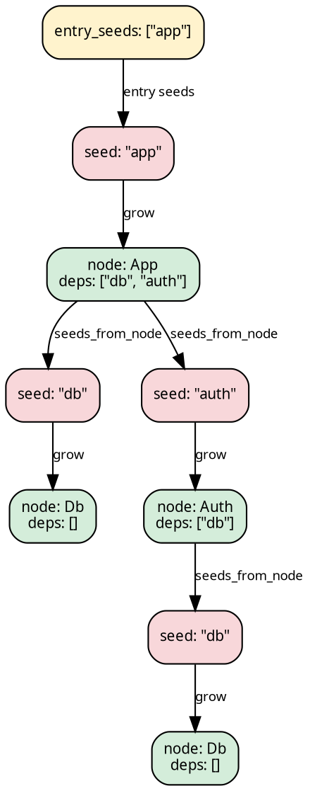

# Stage 1 — SeedPipeline

A `SeedPipeline` has three base slots:

```rust
{{#include ../../../../hylic-pipeline/src/seed/mod.rs:seed_pipeline_struct}}
```

- **`grow: Seed → N`** — resolve a reference (`Seed`) into a
  full node (`N`).
- **`seeds_from_node: Edgy<N, Seed>`** — given a resolved node,
  what references does it point to?
- **`fold: Fold<N, H, R>`** — the algebra over resolved nodes.

The computation is coalgebraic: you hand it a *reference* (a
Seed) at run time, and the pipeline grows the tree on demand
by alternating `grow` and `seeds_from_node` until leaves.



## When to pick this over TreeishPipeline

Use `SeedPipeline` when your dependency graph speaks a different
language from your nodes — file paths, module names, URLs,
anything that needs resolving into a full data structure before
you can see its children.

When you already have nodes whose children are other nodes
(`N → N*`), use [TreeishPipeline](./treeish.md) — simpler, no
grow slot.

## Constructing one

```rust
{{#include ../../../src/docs_examples.rs:pipeline_overview_seed}}
```

## Stage-1 reshapes (inherent methods)

A SeedPipeline can be reshaped without lifting — the result is
still a SeedPipeline of (possibly different) type parameters:

| method                   | changes                                      |
|--------------------------|----------------------------------------------|
| `filter_seeds(pred)`     | `Seed` set narrowed; types preserved         |
| `wrap_grow(w)`           | intercepts every grow; types preserved       |
| `map_node_bi(co, contra)` | changes N to N2 via bijection               |
| `map_seed_bi(to, from)`  | changes Seed to Seed2 via bijection          |

These are provided by the [`SeedSugarsShared`](./sugars.md) trait
(and `SeedSugarsLocal` for the Local domain) — they come into
scope via `use hylic_pipeline::prelude::*;`.

## Transitioning to Stage 2

Stage-2 sugars are ALSO available on a SeedPipeline directly via
auto-lift. Any call to `.wrap_init(w)`, `.zipmap(m)`, etc.
implicitly lifts the pipeline and composes the sugar:

```text
// auto-lifting shape (pseudocode):
let lifted = pipeline
    .wrap_init(|n, orig| orig(n) + 1)     // auto-lifts here
    .zipmap(|r| *r > 100);                 // chains further
// `lifted` is a LiftedPipeline<…, …> with tip R = (u64, bool).
```

If you want the explicit lift (e.g. to pass a raw `Lift` impl
via `then_lift`), use `.lift()`:

```text
let lp = pipeline.lift();           // LiftedPipeline<SeedPipeline<...>, IdentityLift>
let lp = lp.then_lift(my_custom_lift);
```

## Running it

Two entry points, both via the `PipelineExecSeed` trait:

```text
// Entry seeds as a slice (convenience):
let r: u64 = pipeline
    .run_from_slice(&FUSED, &["app".to_string()], 0u64);

// Entry seeds as a general Edgy<(), Seed>:
let entry: Edgy<(), String> =
    edgy_visit(|_: &(), cb: &mut dyn FnMut(&String)| cb(&"app".to_string()));
let r: u64 = pipeline.run(&FUSED, entry, 0u64);
```

The second parameter is the initial heap at the `Entry`
synthetic-root level — what the top-level accumulator starts as
before any seed's result is folded in.

## Internally: how `.run(...)` works

`SeedPipeline::run(...)` composes a [`SeedLift`](../concepts/lifts.md)
onto the chain, which wraps the treeish in the `LiftedNode<N>`
type and dispatches:

- `LiftedNode::Entry` visit → fans out to `LiftedNode::Node(grow(s))`
  for each entry seed.
- `LiftedNode::Node(n)` visit → delegates to the user's
  `seeds_from_node`, wrapping each seed-to-node step through
  `grow`.

The fold is wrapped identically: init at `Entry` returns the
user-supplied `entry_heap`; init at `Node(n)` delegates to the
user's fold. Executor runs from `&LiftedNode::Entry`. The user
never sees the `LiftedNode` variant names — they're internal.

## Full example

```rust
{{#include ../../../src/docs_examples.rs:seed_pipeline_example}}
```
