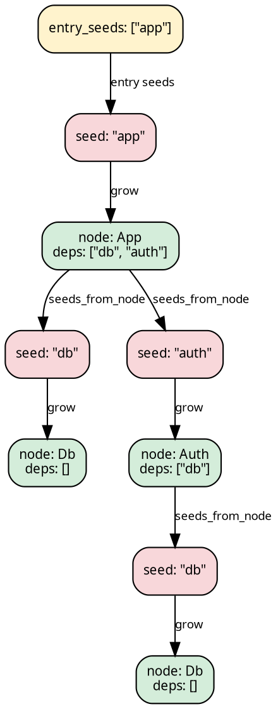

# Stage 1 — SeedPipeline

A `SeedPipeline` carries three base slots:

```rust
{{#include ../../../../hylic-pipeline/src/seed/mod.rs:seed_pipeline_struct}}
```

- **`grow: Seed → N`** — resolves a reference (a `Seed`) into a
  full node (`N`).
- **`seeds_from_node: Edgy<N, Seed>`** — given a resolved node,
  enumerates the references it points to.
- **`fold: Fold<N, H, R>`** — the algebra over resolved nodes.

The pipeline operates lazily on demand: given a reference (a
`Seed`) at run time, it grows the tree by alternating `grow` and
`seeds_from_node` until each branch terminates at a leaf.



## When to pick this over TreeishPipeline

Use `SeedPipeline` when the dependency graph speaks a different
language from the nodes — file paths, module names, URLs, or any
reference that must be resolved into a full data structure
before its children can be examined.

When the nodes themselves already enumerate their children as
nodes of the same type (`N → N*`), [TreeishPipeline](./treeish.md)
is simpler: no grow slot is needed.

## Constructing one

```rust
{{#include ../../../src/docs_examples.rs:pipeline_overview_seed}}
```

## Stage-1 reshapes (inherent methods)

A SeedPipeline can be reshaped without lifting — the result is
still a SeedPipeline of (possibly different) type parameters:

| method                   | changes                                      |
|--------------------------|----------------------------------------------|
| `filter_seeds(pred)`     | `Seed` set narrowed; types preserved         |
| `wrap_grow(w)`           | intercepts every grow; types preserved       |
| `map_node_bi(co, contra)` | changes N to N2 via bijection               |
| `map_seed_bi(to, from)`  | changes Seed to Seed2 via bijection          |

These are provided by the [`SeedSugarsShared`](./sugars.md) trait
(and `SeedSugarsLocal` for the Local domain) — they come into
scope via `use hylic_pipeline::prelude::*;`.

## Transitioning to Stage 2

Stage-2 sugars are **not** available on `SeedPipeline` directly —
an explicit `.lift()` is required, which yields a
[`Stage2Pipeline<SeedPipeline<…>, IdentityLift>`](./lifted.md).

```rust
{{#include ../../../../hylic-pipeline/src/stage2/pipeline.rs:stage2_pipeline_struct}}
```

```text
let lsp = pipeline.lift();          // Stage2Pipeline<SeedPipeline<...>, IdentityLift>
let lsp = lsp
    .wrap_init(|n, orig| orig(n) + 1)
    .zipmap(|r| *r > 100);           // chain grows: tip R = (u64, bool)
```

Each Stage-2 sugar method on a seed-rooted chain is inherent (not
trait-based, in contrast to the treeish-rooted blanket
`LiftedSugarsShared` surface). User closures remain written in
terms of the base node type `N`; internally each sugar dispatches
on the `SeedNode<N>` variant (see
[below](#seed-rooted-stage-2-and-the-seednode-row)).

## Running it

`.run_from_slice` and `.run` are inherent on the seed-rooted
`Stage2Pipeline`. The Stage-1 `SeedPipeline` itself is not
runnable — `.lift()` must come first even when no sugar is
applied:

```text
// Entry seeds as a slice (convenience):
let r: u64 = pipeline
    .lift()
    .run_from_slice(&FUSED, &["app".to_string()], 0u64);

// Entry seeds as a general Edgy<(), Seed>:
let entry: Edgy<(), String> =
    edgy_visit(|_: &(), cb: &mut dyn FnMut(&String)| cb(&"app".to_string()));
let r: u64 = pipeline.lift().run(&FUSED, entry, 0u64);
```

The final parameter is the initial heap at the `Entry`
synthetic-root level — what the top-level accumulator starts as
before any seed's result is folded in. It is always the **base**
`H` type; the chain's own `MapH` is reached internally as the
sugars promote from `H` outward.

## Seed-rooted Stage-2 and the SeedNode row

`Stage2Pipeline<TreeishPipeline<…>, L>` has its chain `L` typed at
the base node type `N` because Stage-1 treeish bases already
present their nodes as `N`. The seed-rooted form
`Stage2Pipeline<SeedPipeline<…>, L>` is different: at run time,
`SeedLift` is the **first** lift in the chain, and its output
node type is `SeedNode<N>` — a [sealed](#sealed-seednode) row
type with two inhabitants: the synthetic `EntryRoot` and a
resolved `Node(N)`. Every subsequent lift in the chain therefore
has to be typed at `SeedNode<N>`, not `N`. Because the chain
type bound differs, seed-rooted sugars cannot share the
treeish-rooted blanket trait surface; each seed-rooted sugar is
inherent, and internally adapts a user closure written over `N`
to the `SeedNode<N>`-typed slot.

For the detailed reasoning and the architectural alternatives
considered, see the
[design doc — pipeline transformability](../design/pipeline_transformability.md).

### Sealed SeedNode

`SeedNode<N>` is exposed as a type name but its variants are
library-internal. User code inspects via three accessors:

- `is_entry_root() -> bool`
- `as_node() -> Option<&N>`
- `map_node<M>(f: FnOnce(&N) -> M) -> SeedNode<M>`

No pattern-match of `EntryRoot` / `Node(N)` is possible from user
code. The seal is motivated by the next point.

### Where SeedNode surfaces at the chain tip

Some lifts propagate `N` into their output result type — e.g.
`.explain()` gives `ExplainerResult<SeedNode<N>, H, R>` at the
chain tip, with the explainer's per-node `heap.node` carrying the
sealed row. For an N-typed view, convert with
`raw.into()` (or `SeedExplainerResult::from(raw)`):

### Seed explainer result

```text
let raw: ExplainerResult<SeedNode<N>, H, R> =
    pipeline.lift().explain().run_from_slice(exec, seeds, h0);
let sealed: SeedExplainerResult<N, H, R> = raw.into();
// sealed.{entry_initial_heap, entry_working_heap, orig_result} — EntryRoot row
// sealed.roots: Vec<ExplainerResult<N, H, R>>              — per-seed subtrees
```

The projection is total below the EntryRoot row (every `Node(n)`
is unwrapped). EntryRoot's own information is promoted out of
the tree as top-level fields; `SeedNode<N>` no longer appears in
the user-visible shape.

Everyday Stage-2 sugar calls (`wrap_init`, `zipmap`, `map_n_bi`,
…) already take closures over `N` — the variant dispatch is
hidden in the sugar body.

## How `.run(...)` works internally

The seed-rooted `Stage2Pipeline::run(...)` assembles a
[`SeedLift`](../concepts/lifts.md) from the base `SeedPipeline`'s
`grow` plus the user-supplied `root_seeds` and `entry_heap`. That
`SeedLift` is composed as the **first** lift of the run-time
chain; the stored chain `L` composes on top. The executor then
begins at `&SeedNode::entry_root()`.

- `SeedNode::EntryRoot` visits fan out into
  `SeedNode::Node(grow(s))` for each entry seed.
- `SeedNode::Node(n)` visits delegate to the user's
  `seeds_from_node`, wrapping each seed-to-node step through
  `grow`.

The fold is wrapped in the same manner: `init` at `EntryRoot`
returns the user-supplied `entry_heap`, while `init` at `Node(n)`
delegates to the user's fold.

## Full example

```rust
{{#include ../../../src/docs_examples.rs:seed_pipeline_example}}
```
