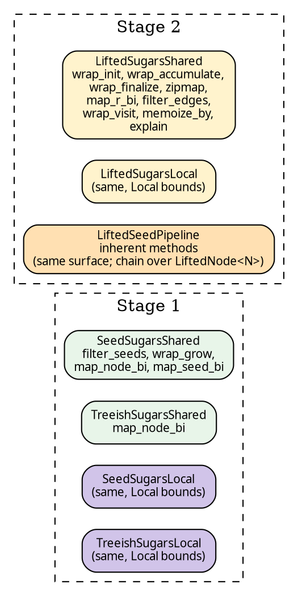

# Blanket sugar traits

Every sugar method on a pipeline — `.wrap_init(w)`, `.zipmap(m)`,
`.filter_seeds(p)` — is defined in a trait rather than as an
inherent method. This choice has one observable benefit and one
consequence.

## The pattern, in a single method

The definition of `wrap_init` on the Stage-2 Shared trait is
representative:

```rust
{{#include ../../../../hylic-pipeline/src/sugars/lifted_shared.rs:wrap_init_default_body}}
```

Three points are worth noting:

- The trait's type parameters are `N, H, R`, not `Self::N`,
  `Self::H`, `Self::R`. Written with projections, Rust's
  normaliser cannot prove that `Self::N` equals the
  implementation's concrete `N` within a default method body.
  Trait parameters avoid the rule entirely.
- The body is a single-step delegation:
  `self.then_lift(<ctor>(wrapper))`. Every sugar in the catalogue
  has this shape — a library-lift constructor wrapped around the
  user's closure, post-composed onto the chain through the
  trait's sole primitive, `then_lift`.
- `Self::With<L2>` is an associated type; each implementation
  pins it to a specific output pipeline type. Three
  implementations exist (below), each with its own
  `With<L2>`.

The remainder of the trait follows the same structure method by
method. Full source:
[`hylic-pipeline/src/sugars/lifted_shared.rs`](../../../../hylic-pipeline/src/sugars/lifted_shared.rs).

## One trait, two implementations (plus one parallel inherent set)

`LiftedSugarsShared` is implemented for two types, distinguished
only by how `then_lift` is realised:

- **`TreeishPipeline<Shared, …>`** — body
  `self.lift().then_lift_raw(l)`. The pipeline is at Stage 1 and
  auto-lifts to Stage 2 first.
- **`LiftedPipeline<Base, L>`** — body `self.then_lift_raw(l)`.
  Already at Stage 2; the chain is merely extended.

`SeedPipeline<Shared, …>` is deliberately **not** a third impl.
Its Stage-2 type is
[`LiftedSeedPipeline`](./seed.md#why-a-separate-stage-2-type-from-lifted-pipelines),
whose chain is typed at `LiftedNode<N>` rather than at `N`;
`LiftedSugarsShared`'s parameter shape doesn't accommodate that.
Instead, `LiftedSeedPipeline` exposes an **inherent** set of
methods mirroring the trait's surface. User closures are still
written over `N`; each inherent sugar internally dispatches on
the `LiftedNode<N>` variant so the user never mentions `Entry` or
`Node(…)` at the call site.

When a user writes `tree_pipeline.wrap_init(w)`, dispatch finds
the `TreeishPipeline` implementation automatically. The Stage 1 →
Stage 2 transition occurs inside `then_lift`, not at the call
site. When a user writes `seed_pipeline.lift().wrap_init(w)`, the
inherent method on `LiftedSeedPipeline` runs.

## Identical code for Shared and Local

Prior to the trait refactor, Local pipelines exposed
`wrap_init_local`, `zipmap_local`, and similar — the `_local`
suffix having been required because two inherent methods with
the same name on a single struct, parameterised differently,
cannot coexist under Rust's trait solver.

With the trait approach, each domain has its own trait
(`LiftedSugarsShared` and `LiftedSugarsLocal`). Method names
coincide at the definition level but not at dispatch; Rust
selects the implementation whose domain parameter matches the
concrete pipeline. User code reads identically across domains:

```text
// Shared and Local, same method names:
let r = shared_pipe.wrap_init(w).zipmap(m).run(...);
let r = local_pipe .wrap_init(w).zipmap(m).run(...);
```

## Consequence: Shared and Local files mirror each other

Each Stage × domain requires a single trait file — four trait
files plus the `LiftedSeedPipeline` inherent-methods file:



Each Shared/Local pair differs only in `Arc` versus `Rc` storage
and in the `Send + Sync` bounds on user closures; the trait
bodies are line-for-line identical. The duplication is
[documented and accepted](../../../hylic/KB/.plans/finishing-up/post-split-review/ACCEPTED-DEBT.md):
collapsing it cleanly would require macros, which the codebase
declines to adopt.

`use hylic_pipeline::prelude::*;` imports every sugar trait in
scope, making every sugar method callable on every pipeline type
that qualifies.

## Catalogue

**Stage 1 — `SeedSugarsShared` / `SeedSugarsLocal`** on
`SeedPipeline<D, N, Seed, H, R>`:

| method                    | output shape                     |
|---------------------------|----------------------------------|
| `filter_seeds(pred)`      | `SeedPipeline<D, N, Seed, H, R>` |
| `wrap_grow(w)`            | `SeedPipeline<D, N, Seed, H, R>` |
| `map_node_bi(co, contra)` | `SeedPipeline<D, N2, Seed, H, R>`|
| `map_seed_bi(to, from)`   | `SeedPipeline<D, N, Seed2, H, R>`|

**Stage 1 — `TreeishSugarsShared` / `TreeishSugarsLocal`** on
`TreeishPipeline<D, N, H, R>`:

| method                     | output shape                    |
|----------------------------|---------------------------------|
| `map_node_bi(co, contra)`  | `TreeishPipeline<D, N2, H, R>`  |

**Stage 2 — `LiftedSugarsShared` / `LiftedSugarsLocal`** on
`TreeishPipeline` (via auto-lift) and on `LiftedPipeline`:

| method                     | what the lift does                    |
|----------------------------|---------------------------------------|
| `wrap_init(w)`             | intercept `init` at every node        |
| `wrap_accumulate(w)`       | intercept `accumulate`                |
| `wrap_finalize(w)`         | intercept `finalize`                  |
| `zipmap(m)`                | extend R: `R → (R, Extra)`            |
| `map_r_bi(fwd, bwd)`       | change R bijectively                  |
| `map_n_bi(co, contra)`     | change N bijectively                  |
| `filter_edges(pred)`       | drop edges from the graph             |
| `wrap_visit(w)`            | intercept graph `visit`               |
| `memoize_by(key)`          | cache subtree results by key          |
| `explain()`                | wrap fold with per-node trace         |

**Stage 2 — inherent methods** on
`LiftedSeedPipeline<SeedPipeline<D, N, Seed, H, R>, L>`: the
same catalogue by name and signature (closures written over
`N`), with internal `LiftedNode<N>` dispatch. `.explain()`
yields `ExplainerResult<LiftedNode<N>, H, R>` at the chain tip,
sealable via
[`SeedExplainerResult::from_lifted`](./seed.md#seed-explainer-result)
for an N-typed view.

Stage-1 reshape `map_node_bi` and Stage-2 sugar `map_n_bi` share
a purpose (change N) but are different operations: Stage 1
rewrites the base slots in-place (cheaper when no lift chain is
present); Stage 2 composes a `ShapeLift` onto the chain and is
available after `.lift()`.
