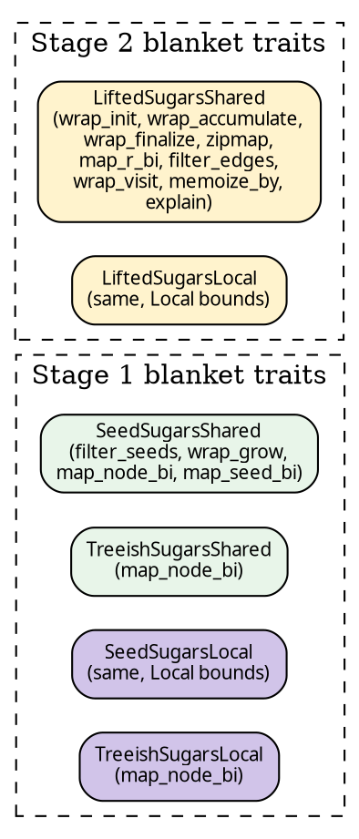

# Blanket sugar traits

Sugar methods on pipelines (`.wrap_init(w)`, `.zipmap(m)`,
`.filter_seeds(p)`, …) are provided by **blanket traits**, not
inherent methods. One trait per (stage × domain), each written
once and shared across every pipeline that qualifies.



## Bringing them into scope

```text
use hylic_pipeline::prelude::*;
```

wildcards every sugar trait, so every sugar method is callable
on every pipeline-type-domain combination you can write.

## How a sugar is defined

The Stage-2 Shared trait lays out the pattern:

```rust
{{#include ../../../../hylic-pipeline/src/sugars/lifted_shared.rs:lifted_sugars_shared_trait}}
```

Each method has:

- A **signature** parametrised on trait type params `N, H, R`
  (not `Self::N / Self::H / Self::R` — this is a deliberate
  choice to avoid Rust's projection-normalisation rules; see
  [the seminar notes](../../../hylic/KB/.plans/finishing-up/notes/seminar-07-blanket-trait-and-rename.md)).
- A **default body** that delegates to `self.then_lift(Shared::<ctor>(…))`.

Because the default body is on the trait, every implementor
inherits it unchanged. There are three impls of the trait (on
`SeedPipeline`, `TreeishPipeline`, `LiftedPipeline`), each
providing a concrete `then_lift` — the actual work — and
`With<L2>` — the output type.

## Auto-lift for Stage-1 pipelines

`LiftedSugarsShared`'s impl for `SeedPipeline<Shared, …>` calls
`self.lift()` before `then_lift_raw(...)`, so Stage-2 sugars work
on a Stage-1 pipeline directly:

```text
let r = seed_pipeline
    .wrap_init(...)   // auto-lifts first
    .zipmap(...)      // composes at the tip
    .run(&exec, entry, 0);
```

## The full catalogue

### Stage 1 — `SeedSugarsShared` / `SeedSugarsLocal`

For `SeedPipeline<D, N, Seed, H, R>`:

| method                   | output shape                              | purpose                 |
|--------------------------|-------------------------------------------|-------------------------|
| `filter_seeds(pred)`     | `SeedPipeline<D, N, Seed, H, R>`          | prune seeds             |
| `wrap_grow(w)`           | `SeedPipeline<D, N, Seed, H, R>`          | intercept grow          |
| `map_node_bi(co, contra)` | `SeedPipeline<D, N2, Seed, H, R>`        | N-change (bijection)    |
| `map_seed_bi(to, from)`  | `SeedPipeline<D, N, Seed2, H, R>`         | Seed-change (bijection) |

### Stage 1 — `TreeishSugarsShared` / `TreeishSugarsLocal`

For `TreeishPipeline<D, N, H, R>`:

| method                    | output shape                     | purpose              |
|---------------------------|----------------------------------|----------------------|
| `map_node_bi(co, contra)` | `TreeishPipeline<D, N2, H, R>`   | N-change (bijection) |

### Stage 2 — `LiftedSugarsShared` / `LiftedSugarsLocal`

For any `LiftedSugars<N, H, R>` implementer (Stage-1 pipelines
via auto-lift, or LiftedPipeline directly):

| method                      | what the lift does                                  |
|-----------------------------|-----------------------------------------------------|
| `wrap_init(w)`              | intercept `init` at every node                      |
| `wrap_accumulate(w)`        | intercept `accumulate` at every node                |
| `wrap_finalize(w)`          | intercept `finalize` at every node                  |
| `zipmap(m)`                 | append `(R, Extra)` to the R axis                   |
| `map_r_bi(fwd, bwd)`        | change R via bijection                              |
| `filter_edges(pred)`        | drop edges from the graph                           |
| `wrap_visit(w)`             | intercept `visit` on the graph                      |
| `memoize_by(key)`           | cache subtree results by key                        |
| `explain()`                 | wrap fold to record per-node trace                  |

N-change sugar is intentionally **only** at Stage 1 (via
`map_node_bi` on Seed/Treeish). At Stage 2 on a
`LiftedPipeline`, use the explicit
`.then_lift(Shared::map_n_bi_lift(co, contra))` instead — this
keeps naming unambiguous across stages.

## Why blanket traits (not inherent methods)

Before the blanket-trait refactor, `SeedPipeline<Local, …>` had
methods like `wrap_init_local`, `zipmap_local`, etc. — `_local`
suffixed because the same NAME on an inherent method on the same
struct type for different type parameters would collide in the
Rust trait solver.

With traits, each domain's impl lives in a separate trait
namespace. `SeedSugarsShared::wrap_init` and
`SeedSugarsLocal::wrap_init` are entirely distinct; Rust dispatches
based on the concrete domain of the pipeline. The `_local` suffix
is gone.

Result: Shared and Local users write identical code (the only
difference is which trait happens to be in scope via
`prelude::*`).

## Writing against these traits

When you write generic code that takes "any Stage-2 pipeline":

```text
fn augment<P, N, H, R>(p: P) -> P::With<ShapeLift<Shared, N, H, R, N, H, R>>
where P: LiftedSugarsShared<N, H, R>,
      N: Clone + 'static, H: Clone + 'static, R: Clone + 'static,
      // (plus the With<L2> where-clause bounds; see trait definition.)
{
    p.wrap_init(|_n, orig| orig(_n))   // no-op, just proof of generic use
}
```

(Fence is `text` — the fully explicit `With<L2>` bounds make this
signature long enough that a faithful example isn't small; the
point is the *shape* of the signature.)

The trait's associated type `With<L2>` carries the concrete
output type that each implementor promises — a SeedPipeline after
a sugar call becomes a LiftedPipeline; a LiftedPipeline after a
sugar call stays a LiftedPipeline with a longer chain.
