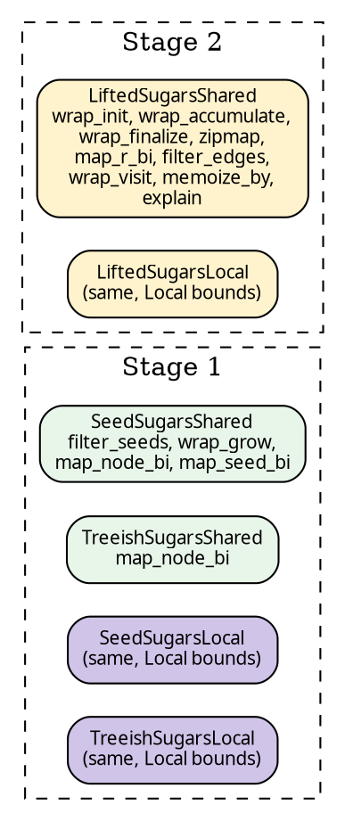

# Blanket sugar traits

Every sugar method on a pipeline — `.wrap_init(w)`, `.zipmap(m)`,
`.filter_seeds(p)` — comes from a trait, not an inherent impl.
This has one observable payoff and one consequence.

## The pattern, in one method

Here's `wrap_init` on the Stage-2 Shared trait:

```rust
{{#include ../../../../hylic-pipeline/src/sugars/lifted_shared.rs:wrap_init_default_body}}
```

Three things to notice:

- The trait's type parameters are `N, H, R` — **not** `Self::N`,
  `Self::H`, `Self::R`. If you write this with projections, Rust's
  normaliser refuses to prove that `Self::N` equals the impl's
  concrete `N` inside a default method body. Trait parameters
  sidestep the rule entirely.
- The body is a one-step delegate: `self.then_lift(<ctor>(wrapper))`.
  Every sugar in the catalogue is this shape — a library lift
  constructor wrapped around the user's closure, post-composed
  onto the chain via the trait's sole primitive `then_lift`.
- `Self::With<L2>` is an associated type each impl pins to a
  specific output pipeline type. Three impls exist (below), each
  with its own `With<L2>`.

The rest of the trait follows the same shape method-by-method.
Full source: [`hylic-pipeline/src/sugars/lifted_shared.rs`](../../../../hylic-pipeline/src/sugars/lifted_shared.rs).

## One trait, three impls

`LiftedSugarsShared` has three implementations, differing only in
how `then_lift` works:

- **`SeedPipeline<Shared, …>`** — body is `self.lift().then_lift_raw(l)`.
  The pipeline is at Stage 1; it auto-lifts to Stage 2 first.
- **`TreeishPipeline<Shared, …>`** — same pattern; auto-lifts first.
- **`LiftedPipeline<Base, L>`** — body is
  `self.then_lift_raw(l)`. Already at Stage 2; just extends the
  chain.

A user writes `seed_pipeline.wrap_init(w)` and dispatch finds the
`SeedPipeline` impl automatically. The Stage 1 → Stage 2
transition happens inside `then_lift` — no `.lift()` at the call
site.

## The payoff: Shared and Local write identical code

Before the trait refactor, Local pipelines had `wrap_init_local`,
`zipmap_local`, etc. — `_local` suffixed because two inherent
methods with the same name on a struct parameterised differently
can't coexist under Rust's trait solver.

With traits, each domain has its own trait (`LiftedSugarsShared` /
`LiftedSugarsLocal`). Method names collide at the definition
level but not at the dispatch level: Rust picks the impl whose
domain parameter matches the concrete pipeline. User code reads
the same across domains:

```text
// Shared and Local, same method names:
let r = shared_pipe.wrap_init(w).zipmap(m).run(...);
let r = local_pipe .wrap_init(w).zipmap(m).run(...);
```

## The consequence: Shared and Local files mirror each other

Each Stage × domain gets one trait file. Five files total:



Each pair (Shared, Local) differs only in `Arc` vs `Rc` storage
and the `Send + Sync` bounds on user closures. The trait body
shapes are line-for-line identical. This duplication is
[documented and accepted](../../../hylic/KB/.plans/finishing-up/post-split-review/ACCEPTED-DEBT.md):
collapsing it cleanly would require macros, which the codebase
declines.

`use hylic_pipeline::prelude::*;` imports every sugar trait, so
every sugar method is callable on every pipeline type that
qualifies.

## Catalogue

**Stage 1 — `SeedSugarsShared` / `SeedSugarsLocal`** on
`SeedPipeline<D, N, Seed, H, R>`:

| method                    | output shape                     |
|---------------------------|----------------------------------|
| `filter_seeds(pred)`      | `SeedPipeline<D, N, Seed, H, R>` |
| `wrap_grow(w)`            | `SeedPipeline<D, N, Seed, H, R>` |
| `map_node_bi(co, contra)` | `SeedPipeline<D, N2, Seed, H, R>`|
| `map_seed_bi(to, from)`   | `SeedPipeline<D, N, Seed2, H, R>`|

**Stage 1 — `TreeishSugarsShared` / `TreeishSugarsLocal`** on
`TreeishPipeline<D, N, H, R>`:

| method                     | output shape                    |
|----------------------------|---------------------------------|
| `map_node_bi(co, contra)`  | `TreeishPipeline<D, N2, H, R>`  |

**Stage 2 — `LiftedSugarsShared` / `LiftedSugarsLocal`** on
anything with a `LiftedSugars<N, H, R>` impl (Stage-1 pipelines
via auto-lift, or `LiftedPipeline` directly):

| method                     | what the lift does                    |
|----------------------------|---------------------------------------|
| `wrap_init(w)`             | intercept `init` at every node        |
| `wrap_accumulate(w)`       | intercept `accumulate`                |
| `wrap_finalize(w)`         | intercept `finalize`                  |
| `zipmap(m)`                | extend R: `R → (R, Extra)`            |
| `map_r_bi(fwd, bwd)`       | change R bijectively                  |
| `filter_edges(pred)`       | drop edges from the graph             |
| `wrap_visit(w)`            | intercept graph `visit`               |
| `memoize_by(key)`          | cache subtree results by key          |
| `explain()`                | wrap fold with per-node trace         |

N-change at Stage 2 is deliberately absent: on a `LiftedPipeline`,
write `.then_lift(Shared::map_n_bi_lift(co, contra))` explicitly.
This keeps the Stage-1 `map_node_bi` (which stays at Stage 1 by
reshape, cheaper) unambiguous against a Stage-2 variant.
